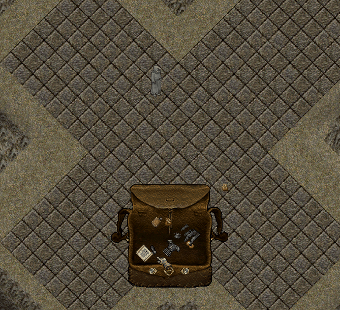

# Armor Bundler

Armor Bundler sistemi sayesinde, zırh setlerinizi tek bir eşya haline getirerek çok daha pratik bir kullanım elde edebilirsiniz.

Mevcut sistemde oyuncular, setleri doğrudan bundle halinde üretebilmektedir. Bu, tek bir eşya üreterek o sete ait tüm parçaları elde etmeniz anlamına gelir.

Bu eşyayı kullandığınızda ise, sete ait tüm parçalar otomatik olarak üzerinize giydirilir.

Yeni Armor Bundler sistemi ile birlikte artık yalnızca üretimle değil, mevcut eşyalarınızı da bundle haline getirebilirsiniz.

Armor Bundler eşyasını, hazine sandıklarından ve dungeon chestlerinden elde edebilirsiniz.

## Bundle Oluşturma

Armor Bundler’a çift tıkladığınızda karşınıza bir arayüz açılır. Bu ekran üzerinden set parçalarını ekleyerek kendi bundle’ınızı oluşturabilirsiniz.

Varsayılan olarak sistem, <mark style="color:red;">**6 parça eklenebilecek**</mark> şekilde açılır.

İlk parça eklendiği anda:

• Bundler’ın rengi, eklediğiniz eşyaya göre değişir

• Eklenebilecek toplam parça sayısı, ilgili sete göre otomatik olarak güncellenir

Setlere göre eklenebilecek parça sayıları şu şekildedir:

• <mark style="color:red;">**Dragonic ve Invul**</mark> setleri: 5 parça

• <mark style="color:red;">**Nordomir**</mark> seti: 6 parça

• <mark style="color:red;">**Platemail**</mark> setleri: 7 parça

Parça ekleme işlemi sırasında herhangi bir sıralama zorunluluğu bulunmaz. Dilediğiniz parçayı istediğiniz sırayla ekleyebilirsiniz.

Eklediğiniz parçaları dilediğiniz zaman Bundler içerisinden çıkarabilirsiniz.

Parça çıkarma işlemi sırasında herhangi bir kısıtlama bulunmaz ve dilediğiniz düzenlemeyi yapabilirsiniz.

Bundle içerisindeki tüm parçalar çıkarıldığında, Armor Bundler <mark style="color:red;">**ilk haline geri döner ve yeniden farklı bir set için kullanılabilir.**</mark>

Bundler içerisine eşya eklerken şu kurallara dikkat etmeniz gerekmektedir:

• Eklediğiniz ilk parçadan sonra yalnızca aynı sete ait parçalar eklenebilir

• Hasar görmüş parçalar eklenemez

• Rengi değiştirilmiş parçalar eklenemez

• Aynı parça birden fazla kez eklenemez

• Sadece çantanızda bulunan set parçalarını ekleyebilirsiniz

Dragonic, Invul ve Nordomir setleri için sistem oldukça basittir. Tüm gerekli parçaları eklediğinizde <mark style="color:red;">**Bundle Yap**</mark> butonu aktif hale gelir.

Bu butona tıkladığınızda, oluşturduğunuz set tek bir eşya (bundle) haline getirilerek çantanıza eklenir.

Ancak bundle oluşturabilmek için ayrıca 20 adet [<mark style="color:red;">**Virtue Stone**</mark>](https://nimloth-uo.gitbook.io/wiki/esyalar/diger-esyalar/virtue-stone) gerekmektedir. Virtue Stone’ları, magical silahları eriterek elde edebilirsiniz.

<figure><figcaption></figcaption></figure>

## Platemail Bundle

Platemail setler için sistemde iki farklı bundle seçeneği bulunmaktadır:

• Kalkanlı Bundle

• Kalkansız Bundle

Kalkanlı bundle oluşturabilmek için toplam 7 parça eklemeniz gerekir.

Eğer yalnızca 6 parça eklerseniz ve bu parçalar arasında kalkan bulunmuyorsa, sistem bunu otomatik olarak kalkansız bundle olarak kabul eder.

Her iki durumda da, gerekli parça sayısına ulaşıldığında Bundle Yap butonu aktif hale gelir. Tercihinize göre kalkanlı veya kalkansız bundle üretimi gerçekleştirebilirsiniz.

