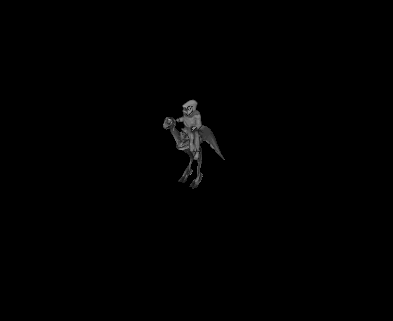
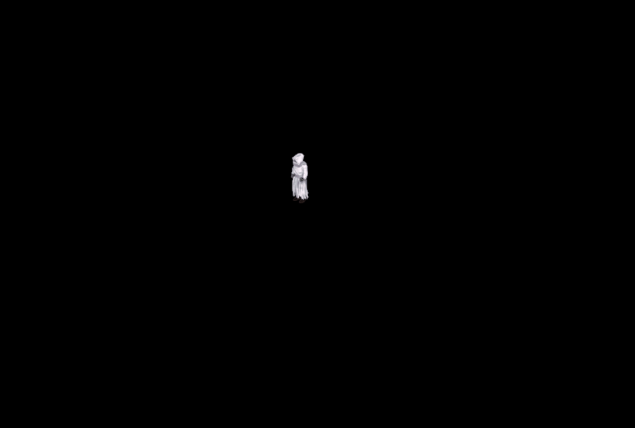
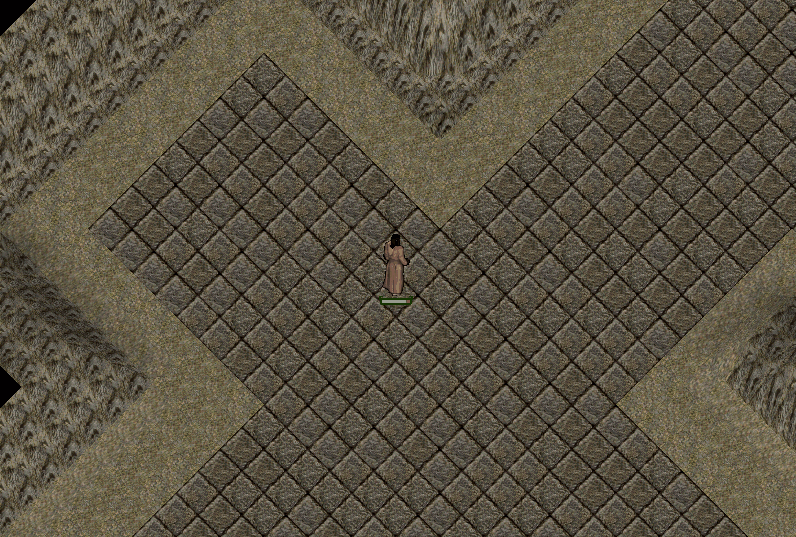
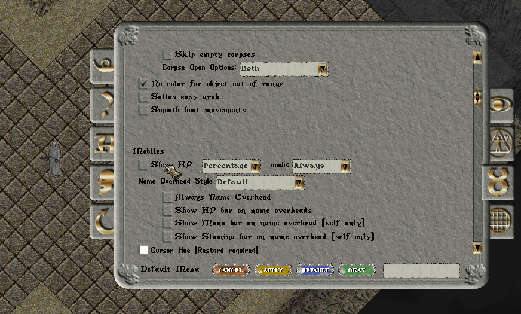

# Oyun Ayarları

ClassicUO istemcisi, oyun deneyiminizi ihtiyaçlarınıza ve oyun tarzınıza göre özelleştirebilmeniz için oldukça kapsamlı ayarlar sunar. Ses ve müzik seçeneklerinden görüntü ayarlarına, arayüz kullanımından karakter kontrollerine kadar birçok özelliği <mark style="color:red;">**Options**</mark> menüsü üzerinden düzenleyebilirsiniz.

UO:Nimloth istemcisinde, ClassicUO'nun standart seçeneklerinin yanı sıra oyun deneyimini geliştirmek amacıyla eklenen çeşitli ayarlar da bulunmaktadır.

Bu sayfada <mark style="color:red;">**Options menüsünde yer alan tüm sekmeleri ve seçenekleri**</mark> inceleyebilir, her ayarın ne işe yaradığını ve oyun içerisinde hangi özellikleri etkilediğini öğrenebilirsiniz.

## Standart Menüye Geçiş

Options menüsünü açtığınızda varsayılan olarak yukarıdaki görselde yer alan <mark style="color:red;">**yeni ayarlar arayüzü**</mark> açılır. Ayarlarınızı bu arayüz üzerinden yönetebileceğiniz gibi, ClassicUO'nun klasik ayarlar menüsünü de kullanabilirsiniz.

Klasik görünüme geçmek için ekranın sol alt kısmında bulunan <mark style="color:red;">**Standart Menu**</mark> seçeneğine tıklayabilirsiniz.

Bu wiki sayfasındaki seçenekler, daha sade bir şekilde takip edilebilmesi için <mark style="color:red;">**Standart Menü**</mark> görünümü üzerinden anlatılacaktır. Her iki menüde de aynı ayarlara erişebilirsiniz.

<figure><figcaption></figcaption></figure>

## Music

Music sekmesi, oyun içerisindeki tüm ses ve müzik ayarlarını yönetebileceğiniz bölümdür. Ses seviyelerini ayrı ayrı belirleyebilir, belirli ses türlerini tamamen kapatabilir veya ClassicUO'nun gelişmiş ses seçeneklerini kullanabilirsiniz.

<figure><figcaption></figcaption></figure>

### **Sounds**

Oyun içerisindeki genel ses efektlerini açıp kapatmanızı ve ses seviyesini belirlemenizi sağlar. Sol taraftaki kutu ile oyun seslerini tamamen açabilir veya kapatabilir, kaydırma çubuğu ile ses seviyesini ayarlayabilirsiniz.

Yaratık sesleri, büyüler, savaş efektleri, eşya sesleri ve çevresel sesler gibi efektler bu ayardan etkilenir.

### **Music**

Oyun içerisinde çalan arka plan müziklerini açıp kapatmanızı ve ses seviyesini belirlemenizi sağlar. Sol taraftaki kutu ile müzikleri tamamen kapatabilir, kaydırma çubuğu ile ses seviyesini ayarlayabilirsiniz.

### **Login Music**

Giriş ve karakter seçim ekranlarında çalan müziği açıp kapatmanızı ve ses seviyesini belirlemenizi sağlar. Sol taraftaki kutu ile giriş müziğini tamamen kapatabilir, kaydırma çubuğu ile ses seviyesini ayarlayabilirsiniz.

### **Play Footsteps**

Karakteriniz hareket ederken ayak seslerinin çalmasını sağlar. Bu seçeneği kapattığınızda hareket sırasında ayak sesi duyulmaz.

### **Play Footsteps \[Surface sensitive]**

Ayak seslerinin üzerinde yürüdüğünüz zemine göre değişmesini sağlar. Taş, ahşap, çim ve benzeri farklı yüzeylerde, zemine uygun ayak sesleri duyabilirsiniz.

> Bu özelliğin kullanılabilmesi için **Play Footsteps** seçeneğinin de açık olması gerekir.

### **Combat Music**

Savaşa girdiğinizde savaş müziğinin çalmasını sağlar. Bu seçeneği kapattığınızda savaş sırasında mevcut arka plan müziği savaş müziğiyle değiştirilmez.

### **Reproduce sounds and music when Client is not focused**

Oyun penceresi aktif olmadığında da oyun seslerinin ve müziklerin çalmaya devam etmesini sağlar. Örneğin oyun açıkken başka bir pencereye geçtiğinizde, bu seçenek açıksa oyun seslerini duymaya devam edebilirsiniz.

### **Play rain sound**

Yağmurlu hava koşullarında yağmur sesinin çalmasını sağlar. Bu seçeneği kapatarak yağmurun görsel olarak devam etmesini ancak yağmur sesinin çalınmamasını sağlayabilirsiniz.

### **Just play my own sounds**

Yalnızca kendi karakterinizle ilişkili seslerin çalmasını sağlar. Çevrenizdeki diğer karakterlerden kaynaklanan sesleri azaltmak ve özellikle kalabalık alanlardaki ses yoğunluğunu önlemek için kullanabilirsiniz.

> **Not:** Aşağıda yer alan <mark style="color:red;">**Disable**</mark> ile başlayan seçenekler, ilgili ses türünü devre dışı bırakmak için kullanılır. Bu seçeneklere tik attığınızda ilgili sesler **kapatılır**, tiki kaldırdığınızda ise tekrar <mark style="color:red;">**aktif hale gelir**</mark>.

### **Disable Craft Sounds**

Craft işlemleri sırasında çalınan üretim seslerini kapatır.

### **Disable Pack Sounds**

Çanta ve konteynerlerle yapılan işlemler sırasında çalınan sesleri kapatır.

### **Disable Animal Sounds**

Hayvanların çıkardığı sesleri kapatır. Bu seçenek açık olduğunda çevrenizde bulunan hayvanlara ait ses efektlerini duymazsınız.

### **Disable Monster Sounds**

Yaratıkların çıkardığı sesleri kapatır. Bu seçenek açık olduğunda çevrenizde bulunan yaratıklara ait ses efektlerini duymazsınız.

### **Disable Item Drop Sounds**

Eşyaları taşıma ve bırakma işlemleri sırasında oluşan eşya bırakma seslerini kapatır.

## Tooltip

Tooltip sekmesi, oyun içerisinde bir eşyanın veya nesnenin üzerine geldiğinizde görüntülenen bilgi pencerelerinin davranışını ve görünümünü düzenlemenizi sağlar. Tooltiplerin gösterilme süresini, boyutunu, arka plan saydamlığını ve yazı tipini bu bölümden değiştirebilirsiniz.

<figure><figcaption></figcaption></figure>

### **Use Tooltip**

Tooltip özelliğini açıp kapatmanızı sağlar. Bu seçenek kapatıldığında oyun içerisinde tooltip bilgileri görüntülenmez.

### **Dynamic Tooltip**

Dinamik tooltip kullanımını açıp kapatmanızı sağlar. Bu özellik açık olduğunda tooltip içerisindeki değişken bilgiler, tooltip açık durumdayken güncellenebilir.

### **Delay Before Display**

Fare imlecini bir nesnenin üzerine getirdiğinizde tooltipin görüntülenmesi için geçmesi gereken süreyi belirler. Değeri düşürdüğünüzde tooltip daha hızlı, yükselttiğinizde ise daha geç görüntülenir.

### **Tooltip Zoom**

Tooltiplerin ekrandaki boyutunu belirler. Değeri yükselterek tooltipleri daha büyük, düşürerek daha küçük görüntüleyebilirsiniz.

### **Tooltip Background Opacity**

Tooltip arka planının saydamlık seviyesini belirler. Değer yükseldikçe arka plan daha belirgin, düşürüldükçe daha saydam hale gelir.

### **Tooltip Font Hue**

Tooltip yazılarında renk kullanımını açıp kapatmanızı sağlar. Bu seçeneği aktif ettiğinizde tooltip yazılarının görüntüleneceği rengi belirleyebilirsiniz.

### **Tooltip Font**

Tooltiplerde kullanılacak yazı tipini seçmenizi sağlar. Listede bulunan farklı yazı tiplerinin nasıl göründüğünü doğrudan seçeneklerin üzerinde görebilir ve kullanmak istediğiniz yazı tipini işaretleyebilirsiniz.

## Fonts

<figure><figcaption></figcaption></figure>

**Fonts** sekmesi, oyun içerisinde kullanılan bazı yazı tiplerini değiştirmeye yönelik seçenekleri içerir.

> **Not:** Bu bölümde yer alan ayarlar UO:Nimloth'ta aktif olarak kullanılmamaktadır. Bu nedenle bu seçeneklerde değişiklik yapmanıza gerek yoktur.

### **Override Game Font**

Oyunun varsayılan yazı tipinin yerine farklı bir font kullanımını sağlar.

### **Force Unicode in Journal**

Journal içerisinde yer alan metinlerin Unicode olarak görüntülenmesini sağlar.

### **Override Game Font Style**

Oyunda kullanılan yazı tipinin stilini değiştirmeyi sağlar.

## **Speech**

Speech sekmesi, oyun içerisindeki konuşma ve mesajlaşma özelliklerini yönetmenizi sağlar. Konuşma gecikmesi, Journal kayıtları, sohbet penceresinin kullanımı ve farklı mesaj türlerinin renkleri gibi ayarları bu bölümden değiştirebilirsiniz.

<figure><figcaption></figcaption></figure>

### **Scale Speech Delay**

Karakterlerin üzerinde görüntülenen konuşma metinlerinin ekranda kalma süresini, mesajın uzunluğuna göre ölçeklendirir. Yanındaki kaydırma çubuğu ile bu sürenin seviyesini ayarlayabilirsiniz.

### **Save Journal to File in Game Folder**

Journal üzerinde görüntülenen mesajların oyun klasörüne bir dosya olarak kaydedilmesini sağlar. Önceki konuşma ve Journal kayıtlarını daha sonra incelemek istediğinizde kullanabilirsiniz.

### **Active Chat When Pressing ENTER**

`Enter` tuşuna bastığınızda Chat sisteminin aktif hale gelmesini sağlar.

#### **Use Additional Buttons to Activate Chat**

Chat sistemini yalnızca `Enter` ile değil, ekranda belirtilen ek karakter ve tuşlarla da aktif hale getirmenizi sağlar.

#### **Use 'Shift+Enter' to Send Message Without Closing Chat**

`Shift + Enter` ile mesaj gönderdiğinizde Chat penceresinin açık kalmasını sağlar. Art arda mesaj yazmak istediğinizde Chat'i tekrar açmanız gerekmez.

### **Hide Chat Gradient**

Chat alanında kullanılan arka plan geçiş efektini gizler.

### **Chat Multiline \[Restart Required]**

Chat alanında birden fazla satır kullanılmasını sağlar. Bu ayarda yapılan değişikliğin uygulanabilmesi için oyunun yeniden başlatılması gerekir.

### **Yazarken karakterimin üstünde "..." göster**

Mesaj yazmaya başladığınızda karakterinizin üzerinde `...` göstergesi görüntülenmesini sağlar. Böylece çevrenizdeki oyuncular bir mesaj yazmakta olduğunuzu görebilir.

### **Başkalarının yazma göstergesini göster**

Diğer oyuncular mesaj yazarken karakterlerinin üzerinde `...` göstergesini görmenizi sağlar.

<figure><figcaption></figcaption></figure>

### **Hide Guild Chat**

Guild üzerinden gönderilen mesajların görüntülenmesini engeller.

### **Hide Alliance Chat**

Alliance üzerinden gönderilen mesajların görüntülenmesini engeller.

### **Show Party Messages Overhead**

Party mesajlarının yalnızca ilgili mesaj alanlarında değil, mesajı gönderen karakterlerin üzerinde de görüntülenmesini sağlar.

### **Randomize Speech Hues**

Konuşmalarda kullanılan renkleri rastgele değiştirir.

Alt bölümde ise farklı konuşma ve mesaj türlerinde kullanılacak renkleri ayrı ayrı belirleyebilirsiniz:

* Speech Color: Normal konuşmaların rengini belirler.
* Emote Color: Emote mesajlarının rengini belirler.
* Yell Color: Yell ile gönderilen mesajların rengini belirler.
* Whisper Color: Whisper ile gönderilen mesajların rengini belirler.
* Party Message Color: Party mesajlarının rengini belirler.
* Guild Message Color: Guild mesajlarının rengini belirler.
* Alliance Message Color: Alliance mesajlarının rengini belirler.
* Chat Message Color: Chat mesajlarının rengini belirler.

Renk kutularına tıklayarak ilgili mesaj türünde kullanılmasını istediğiniz rengi değiştirebilirsiniz.

<figure><figcaption></figcaption></figure>

## Macro Ayarları

Macro sekmesi, sık kullandığınız işlemleri klavye tuşlarına veya tuş kombinasyonlarına atamanızı sağlar. Büyü kullanımı, kapı açma, hedef alma veya belirli oyun işlevlerini çalıştırma gibi birçok işlemi makrolar sayesinde tek bir tuşla gerçekleştirebilirsiniz.

Oluşturduğunuz makrolar ekranın sol tarafındaki listede görüntülenir. Bir tuşa makro atadığınızda ayrıca isim vermeniz gerekmez; makro, varsayılan olarak atandığı <mark style="color:red;">**tuş veya tuş kombinasyonunun adıyla**</mark> listelenir.

<figure><figcaption></figcaption></figure>

### Makro Oluşturma ve Düzenleme

#### **Add**

Yeni bir makro oluşturmanızı ve kullanmak istediğiniz tuş veya tuş kombinasyonunu atamanızı sağlar.

#### **Delete**

Seçili makroyu siler.

#### **Previous / Next**

Makro içerisinde birden fazla işlem bulunuyorsa işlemler arasında geçiş yapmanızı sağlar.

#### **Rename**

Seçili makroya özel bir isim vermenizi sağlar. Makrolar varsayılan olarak atandıkları tuşun adıyla gösterildiğinden isimlendirme zorunlu değildir. Ancak çok sayıda makro kullanıyorsanız makrolarınızı daha kolay ayırt etmek için bu seçeneği kullanabilirsiniz.

#### **Create Macro Button**

Seçili makro için oyun ekranına yerleştirilebilen bir buton oluşturur. Böylece makroyu klavyedeki tuş atamasının yanı sıra ekrandaki butona tıklayarak da çalıştırabilirsiniz.

#### **Add / Remove**

Makronun gerçekleştireceği işlemleri eklemenizi veya mevcut işlemleri kaldırmanızı sağlar. Açılır listeden makroya eklemek istediğiniz komutu seçebilirsiniz.

### Makro Yönetimi

#### **İsimlendir**

Oluşturulmuş tüm makroların isimlerini mevcut tuş atamalarına göre yeniden düzenler. Özellikle başka sunuculardan veya farklı istemci kurulumlarından alınan makroların isimlerini mevcut tuşlarla eşleştirmek için kullanışlıdır.

#### **Delete All**

Oyuncu tarafından oluşturulmuş tüm makroları siler.

#### **Backup**

Mevcut makrolarınızı bulut sunucuya yedekler. Böylece makro ayarlarınızı daha sonra tekrar kullanmak üzere saklayabilirsiniz.

#### **Restore**

Daha önce bulut sunucuya yedeklediğiniz makroları indirerek geri yükler.

#### **Load Default**

Makro ayarlarını standart makrolara geri döndürür.

#### **Import Macro**

Eski makro sisteminde kullanılan <mark style="color:red;">**macros.txt**</mark> dosyasındaki makroları yeni makro formatına dönüştürerek içe aktarmanızı sağlar. Eski makrolarınızı yeni sisteme taşımak için bu seçeneği kullanabilirsiniz.

#### **Open Folder**

Makro dosyalarının bulunduğu klasörü açar. Makro dosyalarına doğrudan erişmeniz gerektiğinde bu seçeneği kullanabilirsiniz.

### UO:Nimloth Makroları

Standart makro seçeneklerinin yanı sıra UO:Nimloth'ta kullanabileceğiniz ek makro işlevleri de bulunmaktadır.

#### **Target**

Bir oyuncuyu hedef olarak seçmenizi sağlar. Özellikle hedef seçiminin hızlı bir şekilde yapılması gereken durumlarda kullanabilirsiniz.

#### **BackpackLayout**

Çantanızdaki eşyaların yerleşimini kaydetmenizi ve daha sonra kayıtlı yerleşime geri döndürmenizi sağlar. Çanta düzeniniz bozulduğunda eşyalarınızı daha önce kaydettiğiniz konumlara tekrar yerleştirebilirsiniz.

> **Premium Özellik:** BackpackLayout makrosu yalnızca [<mark style="color:red;">**Premium**</mark>](https://nimloth-uo.gitbook.io/wiki/sistemler/premium-sistemi) oyuncular tarafından kullanılabilir.

## Video

Video sekmesi, oyunun görüntü performansını ve oyun alanının ekrandaki yerleşimini düzenlemenizi sağlar. FPS sınırı, pencere kullanımı, çözünürlük ve görüntüleme ile ilgili diğer seçenekleri bu bölümden değiştirebilirsiniz.

<figure><figcaption></figcaption></figure>

### **FPS**

Oyunun saniyede göstereceği kare sayısını belirler. Değer yükseldikçe hareketler ve animasyonlar daha akıcı görüntülenir. Daha yüksek FPS değerleri sistem kaynaklarının kullanımını artırabilir.\
FPS <mark style="color:red;">**12-360 arasında**</mark> seçilebilir.

### **Reduce FPS When Game Is Inactive**

Oyun penceresi aktif olmadığında FPS değerini otomatik olarak düşürür. Başka bir pencereye geçtiğinizde oyunun gereksiz yere sistem kaynaklarını kullanmasını azaltmak için tercih edebilirsiniz.

### **High DPI \[Restart Required]**

Yüksek DPI değerine sahip ekranlarda arayüzün ve görüntünün uygun şekilde ölçeklendirilmesini sağlar. Özellikle yüksek çözünürlüklü ekranlarda kullanılabilir. Değişikliğin uygulanması için oyunun yeniden başlatılması gerekir.

### **Ask to Reopen After Closing \[Restart Required]**

Oyun kapatıldığında tekrar açılıp açılmayacağını soran onay penceresinin gösterilmesini sağlar. Değişikliğin uygulanması için oyunun yeniden başlatılması gerekir.

### **Driver \[Restart Required]**

Oyunun görüntü oluşturmak için kullanacağı grafik sürücüsünü seçmenizi sağlar. Normal kullanımda <mark style="color:red;">**Default**</mark> seçeneğini değiştirmeniz gerekmez. Yapılan değişikliklerin uygulanması için oyunun yeniden başlatılması gerekir.

### **Language \[Restart Required]**

İstemci arayüzünde kullanılacak dili belirler. Dil değişikliğinin uygulanması için oyunun yeniden başlatılması gerekir.

<mark style="color:red;">**Varsayılan olarak ENU(İngilizce) gelmektedir fakat buradan TRK(Türkçe) dilini seçerek ayarları Türkçe de görüntüleyebilirsiniz.**</mark>

### Game Window

Bu bölüm, oyun dünyasının görüntülendiği alanın ekrandaki konumunu ve boyutunu düzenlemenizi sağlar.

### **Always Use Fullsize Game Window**

Oyun alanının kullanılabilir pencere alanını tamamen kaplayacak şekilde görüntülenmesini sağlar. Bu seçenek aktifken manuel olarak belirlenen oyun alanı boyutları kullanılmaz.

### **Borderless Window**

Oyunun pencere kenarlıkları olmadan görüntülenmesini sağlar.

### **Lock Game Window Moving/Resizing**

Oyun alanının yanlışlıkla taşınmasını veya boyutunun değiştirilmesini engeller. Oyun alanınızı istediğiniz şekilde ayarladıktan sonra sabitlemek için kullanabilirsiniz.

### **Game Play Window Position**

Oyun dünyasının görüntülendiği alanın pencere içerisindeki konumunu belirler. Buradaki iki değer sırasıyla yatay (X) ve dikey (Y) konumu ifade eder.

### **Game Play Window Size**

Oyun dünyasının görüntülendiği alanın genişliğini ve yüksekliğini belirler. İlk değer <mark style="color:red;">**genişliği**</mark>, ikinci değer ise <mark style="color:red;">**yüksekliği**</mark> ifade eder. Böylece oyun alanını ekran çözünürlüğünüze ve kullandığınız arayüz düzenine göre özelleştirebilirsiniz.

### **Default Zoom**

Oyuna giriş yaptığınızda kullanılacak varsayılan yakınlaştırma seviyesini belirler.

### **Screen Zoom**

Oyun ekranının yakınlaştırma seviyesini belirler. Değeri değiştirerek oyun dünyasını daha yakından veya daha uzaktan görüntüleyebilirsiniz.

### **Enable Mousewheel for In Game Zoom Scaling \[Ctrl + Scroll]**

Oyun içerisinde <mark style="color:red;">**Ctrl + fare tekerleği**</mark> kombinasyonunu kullanarak yakınlaştırma seviyesini değiştirmenizi sağlar. Bu seçenek aktif olduğunda oyun sırasında hızlı bir şekilde yakınlaşıp uzaklaşabilirsiniz.

### **Releasing Ctrl Restores Scale**

`Ctrl + Scroll` ile geçici olarak değiştirdiğiniz yakınlaştırma seviyesinin, <mark style="color:red;">**Ctrl tuşunu bıraktığınızda önceki seviyesine dönmesini**</mark> sağlar.

### Işık Ayarları

Bu bölüm oyun dünyasındaki ışıklandırmanın nasıl görüntüleneceğini belirler.

> **Not:** Kırmızı renkle gösterilen ayarlar UO:Nimloth tarafından belirlenmektedir ve oyuncular tarafından değiştirilemez.

### **Alternative Lights**

Alternatif ışıklandırma sisteminin kullanılmasını sağlar. Bu seçenek UO:Nimloth'ta oyuncular tarafından <mark style="color:red;">**değiştirilemez**</mark>.

### **Light Level**

Oyun dünyasının genel ışık seviyesini belirler. Bu değer UO:Nimloth tarafından yönetildiği için oyuncular tarafından <mark style="color:red;">**değiştirilemez**</mark>.

### **Light Level Setting Type**

Işık seviyesinin nasıl uygulanacağını belirler. Mevcut seçim olan <mark style="color:red;">**Absolute**</mark>, belirlenen ışık seviyesinin doğrudan uygulanmasını sağlar.

### **Dark Nights**

Gece saatlerinde daha karanlık bir görüntü kullanılmasını sağlar. Aktif olduğunda gece ve gündüz arasındaki ışık farkı daha belirgin hale gelir.

### **Use Colored Lights**

Işık kaynaklarının kendilerine ait renklerle görüntülenmesini sağlar. Örneğin farklı renkte ışık üreten kaynakların çevreye yaydığı ışık da kendi rengine uygun şekilde görüntülenir.

### **Enable Death Screen**

Karakteriniz öldüğünde ölüm ekranı efektinin görüntülenmesini sağlar.

### **Black & White Mode for Dead Player**

Karakteriniz öldüğünde oyun dünyasının siyah-beyaz olarak görüntülenmesini sağlar. Bu seçenek kapatıldığında ölü durumdayken de dünya renkli olarak görüntülenmeye devam eder.

### **Run Mouse in a Separate Thread**

Fare hareketlerinin oyun içerisindeki diğer işlemlerden ayrı bir işlem dizisinde çalışmasını sağlar. Özellikle oyunun yoğun olduğu durumlarda fare hareketlerinin daha akıcı ve tepkisel kalmasına yardımcı olabilir.

### **Aura on Mouse Target**

Fare imlecini bir karakter veya uygun bir hedefin üzerine getirdiğinizde hedefin daha kolay fark edilmesini sağlayan görsel bir aura efekti gösterir.

### **Animated Water Effect**

Su yüzeylerinde animasyon efektlerinin kullanılmasını sağlar. Aktif olduğunda deniz, nehir ve benzeri su alanları hareketli olarak görüntülenir.

### **Weather Effects**

Yağmur ve benzeri hava durumu efektlerinin oyun ekranında görüntülenmesini sağlar.

### **Show Head on Top of All Layers**

Karakterlerin baş kısmının diğer grafik katmanlarının üzerinde görüntülenmesini sağlar. Özellikle karakterin bazı nesnelerin veya grafiklerin arkasında kaldığı durumlarda baş kısmının görünür kalmasına yardımcı olur.

<figure><figcaption></figcaption></figure>

### **Shadows**

Oyun dünyasındaki gölge efektlerini açıp kapatmanızı sağlar.

### **Show Tree and Rock Shadows**

Ağaç ve kayaların gölgelerinin görüntülenmesini sağlar. Bu seçeneğin etkili olabilmesi için <mark style="color:red;">**Shadows**</mark> seçeneğinin de açık olması gerekir.

### **Terrain Shadows Level**

Arazi üzerinde kullanılan gölgelerin seviyesini belirler. Değeri değiştirerek zemin ve arazi üzerindeki gölgelendirme yoğunluğunu ayarlayabilirsiniz.

## Reputation

Reputation sekmesi, hedefleme ve savaş davranışlarının yanı sıra bazı arayüz ve aksiyon çubuğu seçeneklerini düzenlemenizi sağlar.

<figure><figcaption></figcaption></figure>

### **Use New Target System**

Yeni hedefleme sisteminin kullanılmasını sağlar. Aktif olduğunda hedef seçiminde geliştirilmiş hedefleme özellikleri kullanılır.

<figure><figcaption></figcaption></figure>

### **Hold TAB Key for Combat**

`TAB` tuşunun War/Peace moduna geçiş davranışını belirler. Bu seçenekle birlikte aşağıdaki üç kullanım şeklinden birini seçebilirsiniz:

* <mark style="color:red;">**Toggle - her basışta war/peace değiştir**</mark>**:** TAB tuşuna her bastığınızda War ve Peace modları arasında geçiş yapılır.
* <mark style="color:red;">**Her zaman War moduna geç**</mark>**:** TAB tuşuna bastığınızda karakteriniz War moduna geçer.
* <mark style="color:red;">**Her zaman Peace moduna geç**</mark>**:** TAB tuşuna bastığınızda karakteriniz Peace moduna geçer.

### **Query Before Attack**

Bir hedefe saldırmadan önce onay sorulmasını sağlar. Yanlışlıkla bir oyuncuya veya hedefe saldırmanızı önlemek için kullanılabilir.

### **Query Before Performing Beneficial Acts on Murderers, Criminals, Grays \[Monsters/Animals]**

Murderer, Criminal veya Gray durumundaki karakterlere faydalı bir eylem gerçekleştirmeden önce onay ister. Örneğin bu hedeflere iyileştirme veya faydalı bir büyü uygulamaya çalıştığınızda yanlışlıkla işlem yapmanızı önlemeye yardımcı olur.

### **Enable Overhead Spell Format**

Karakterlerin üzerinde görüntülenen büyü bilgilerinde alternatif gösterim formatının kullanılmasını sağlar.

<figure><figcaption></figcaption></figure>

### **Enable Overhead Spell Hue**

Karakterlerin üzerinde görüntülenen büyü yazılarında büyüye göre renk kullanımını etkinleştirir.

### **Single Click UI Buttons**

Arayüz üzerindeki büyü butonların tek tıklama ile çalışmasını sağlar.

### **Action Progressbar**

Belirli işlemler gerçekleştirilirken işlemin ilerleme durumunu gösteren progress barın görüntülenmesini sağlar.

### **Spell/Skill Bar Sayısı**

Ekranda kullanabileceğiniz <mark style="color:red;">**Spell**</mark>**/Skill Bar** sayısını belirler. Kaydırma çubuğu üzerinden ihtiyacınıza göre bar sayısını artırabilir veya azaltabilirsiniz.

### **Custom Bar Sayısı**

Ekranda kullanabileceğiniz <mark style="color:red;">**Custom Bar**</mark> sayısını belirler. Kaydırma çubuğu üzerinden aynı anda kullanmak istediğiniz Custom Bar miktarını ayarlayabilirsiniz.

### Spell Visual Indicator

Büyü kullanımı sırasında görsel göstergelerin görüntülenmesini sağlar. Bu özellik sayesinde büyü kullanımını görsel olarak takip edebilirsiniz.

### Show Buff Duration

Karakterinize uygulanan Buff ve Debuff etkilerinin kalan sürelerini görüntülemenizi sağlar.

<figure><figcaption></figcaption></figure>

### Enable Fast Spells Assign \[Ctrl + Alt]

Büyüleri hızlı bir şekilde atamanızı sağlar. `Ctrl + Alt` tuş kombinasyonunu kullanarak büyüleri ilgili arayüz öğelerine daha pratik şekilde atayabilirsiniz.

### Show DPS With Damage Numbers

Verdiğiniz hasarlarla birlikte saniye başına verdiğiniz hasar miktarının (DPS) görüntülenmesini sağlar.

<figure><figcaption></figcaption></figure>

### Modern Floating Damage Numbers

Hasar miktarlarının modern bir görsel biçimde görüntülenmesini sağlar. Bu seçenek açık olduğunda hasar sayıları alternatif bir animasyon ve gösterim biçimiyle sunulur.

<figure><figcaption></figcaption></figure>

### Karakter ve Büyü Renkleri

Bu bölümde, karakterlerin itibar durumlarına ve büyülerin türlerine göre kullanılan renkleri özelleştirebilirsiniz.

<figure><figcaption></figcaption></figure>

#### Innocent Color

Masum (Innocent) karakterlerin görüntüleneceği rengi belirler.

#### **Friend Color**

Arkadaş olarak tanımladığınız karakterlerin görüntüleneceği rengi belirler.

#### Criminal Color

Criminal durumundaki karakterlerin görüntüleneceği rengi belirler.

#### Can Be Attacked Color

Saldırılabilir durumdaki karakterlerin görüntüleneceği rengi belirler.

#### Murderer Color

Murderer durumundaki karakterlerin görüntüleneceği rengi belirler.

#### Enemy Color

Düşman olarak değerlendirilen karakterlerin görüntüleneceği rengi belirler.

#### Benefic Spell Hue

Faydalı büyülerin gösteriminde kullanılacak rengi belirler. İyileştirme ve güçlendirme gibi büyüleri diğer büyülerden ayırt etmenizi sağlar.

<figure><figcaption></figcaption></figure>

#### Harmful Spell Hue

Zarar verici büyülerin gösteriminde kullanılacak rengi belirler. Saldırı amaçlı büyüleri daha kolay fark etmenizi sağlar.

<figure><figcaption></figcaption></figure>

#### Neutral Spell Hue

Faydalı veya zararlı olarak sınıflandırılmayan büyülerin gösteriminde kullanılacak rengi belirler.

### Spell Overhead Format

Karakterlerin üzerinde görüntülenen büyü yazılarının biçimini özelleştirmenizi sağlar. Metin alanında aşağıdaki değişkenleri kullanabilirsiniz:

* `{power}`: Büyünün söylenen güç kelimelerini (Power Words) temsil eder.
* `{spell}`: Büyünün adını temsil eder.

Örneğin `{power} [{spell}]` şeklinde bir format belirlediğinizde, büyü kullanımı sırasında karakterin üzerinde hem güç kelimeleri hem de büyünün adı görüntülenebilir.

> Not: Bu formatın kullanılabilmesi için önceki bölümde yer alan Enable Overhead Spell Format seçeneğinin aktif olması gerekir.

### **Hasar alındığında kamera sallan**

Karakteriniz hasar aldığında oyun ekranında kamera sallanma efekti uygulanmasını sağlar. Efektin ne zaman ve ne kadar güçlü uygulanacağını aşağıdaki seçeneklerden ayarlayabilirsiniz.

<figure><figcaption></figcaption></figure>

<figure><figcaption></figcaption></figure>

### **Sallanma Eşiği (Bu Hasarın Üzerinde Tetiklenir)**

Kamera sallanma efektinin devreye girmesi için alınması gereken minimum hasar miktarını belirler. Bu değerin altındaki hasarlarda kamera sallanmaz.

### **Sallanma Şiddeti (Eşiği Aşan Hasar Başına)**

Alınan hasar, belirlenen eşiği aştıkça kamera sallanmasının ne kadar güçleneceğini belirler. Değer yükseldikçe yüksek hasarlarda oluşan sallanma daha belirgin hale gelir.

### **Maksimum Sallanma Mesafesi (Piksel)**

Kamera sallanmasının ulaşabileceği maksimum hareket mesafesini belirler. Böylece çok yüksek hasar alınsa bile ekranın belirlediğiniz değerden daha fazla sallanmasını engelleyebilirsiniz.

### **Vurulan Hedefte Kan Efekti Göster**

Saldırdığınız hedef hasar aldığında hedef üzerinde kan efektinin görüntülenmesini sağlar.

<figure><figcaption></figcaption></figure>

### **Hasar Alındığında Ekrana Kan Sıçrasın**

Karakteriniz hasar aldığında ekran üzerinde kan sıçraması efektinin görüntülenmesini sağlar.

### **Kan/Ses Efekti Yoğunluğu**

Hasar sırasında kullanılan kan ve ses efektlerinin yoğunluğunu belirler. Değeri yükselterek efektleri daha belirgin, düşürerek daha hafif hale getirebilirsiniz.

<figure><figcaption></figcaption></figure>

## General

General sekmesi, oyunun genel kullanım davranışlarını düzenleyebileceğiniz seçenekleri içerir. Klavye ile hareket, bildirimler, otomatik koşma, pathfinding ve cesetlerin açılması gibi temel oyun ayarlarını bu bölümden değiştirebilirsiniz.

> <mark style="color:red;">**Not:**</mark> <mark style="color:red;"></mark><mark style="color:red;">Kırmızı renkle gösterilen ayarlar UO:Nimloth tarafından belirlenmektedir ve oyuncular tarafından değiştirilemez.</mark>

<figure><figcaption></figcaption></figure>

### **Options Menu Font Hue**

Ayarlar menüsünde kullanılan yazıların rengini değiştirmenizi sağlar.

### **Move with Arrow Keys**

Karakterinizi klavyedeki yön tuşlarını kullanarak hareket ettirmenizi sağlar.

### **Turn on Push Notifications**

Oyun tarafından desteklenen bildirimlerin kullanılmasını sağlar.

### **Auto Focus on Text Areas**

Bir metin giriş alanı açıldığında yazı yazabilmeniz için ilgili alanın otomatik olarak seçilmesini sağlar.

### **Highlight Game Objects**

Fare imlecini oyun içerisindeki nesnelerin üzerine getirdiğinizde nesnenin vurgulanmasını sağlar. Etkileşim kurulabilecek nesneleri daha kolay ayırt etmenize yardımcı olur.

### **Fast Rotation**

Karakteriniz yön değiştirirken daha hızlı dönüş yapılmasını sağlar.

### **Enable Pathfinding**

Pathfinding özelliğini aktif hale getirir. Ulaşmak istediğiniz bir konum için pathfinding kullanıldığında karakteriniz uygun yolu hesaplayarak hedefe doğru otomatik olarak hareket eder.

### **Use SHIFT for Pathfinding**

Pathfinding özelliğinin **Shift** tuşuyla birlikte kullanılmasını sağlar. Böylece normal hareket ve pathfinding kullanımını birbirinden ayırabilirsiniz.

### **Always Run**

Karakterinizin varsayılan olarak koşarak hareket etmesini sağlar.

### **Unless Hidden**

<mark style="color:red;">**Always Run**</mark> aktifken karakteriniz Hidden durumundaysa otomatik koşmayı devre dışı bırakır. Böylece gizlenmiş durumdayken karakteriniz yürümeye devam eder.

### **Auto Open Doors**

Yaklaştığınız kapıların otomatik olarak açılmasını sağlar. <mark style="color:red;">**Bu ayar oyuncular tarafından değiştirilemez.**</mark>

### **Smooth Doors**

Kapıların açılıp kapanmasında daha akıcı bir görsel geçiş kullanılmasını sağlar. <mark style="color:red;">**Bu ayar oyuncular tarafından değiştirilemez.**</mark>

### **Auto Open Corpses**

Yakınınızdaki cesetlerin otomatik olarak açılmasını sağlar. <mark style="color:red;">**Bu ayar oyuncular tarafından değiştirilemez.**</mark>

### **Corpse Open Range**

<mark style="color:red;">**Bu ayar UO:Nimloth'ta kullanılmamaktadır.**</mark>

### **Skip Empty Corpses**

Boş olan cesetlerin açılmasını engeller. Bu seçenek aktif olduğunda içerisinde eşya bulunmayan cesetler açılmaz. <mark style="color:red;">**Bu ayar UO:Nimloth'ta kullanılmamaktadır.**</mark>

### **Corpse Open Options**

<mark style="color:red;">**Bu ayar UO:Nimloth'ta kullanılmamaktadır.**</mark>

### **No Color for Object Out of Range**

Erişim mesafenizin dışında kalan nesnelerin farklı bir renk tonuyla gösterilmesini engeller. Bu seçenek aktif olduğunda menzil dışındaki nesneler normal renkleriyle görüntülenmeye devam eder.

<figure><figcaption></figcaption></figure>

### **Sallos Easy Grab**

Eşyaların daha kolay seçilmesini ve sürüklenmesini sağlayan Sallos tarzı eşya tutma davranışını aktif hale getirir.

### **Smooth Boat Movements**

Gemi hareketlerinin daha akıcı görüntülenmesini sağlar. Aktif olduğunda gemi hareketleri arasındaki geçişler daha yumuşak şekilde gösterilir.

### Mobiles

Bu bölüm, oyuncu ve NPC'lerin isimleri ile birlikte görüntülenen can, mana ve stamina bilgilerinin görünümünü düzenlemenizi sağlar.

<figure><figcaption></figcaption></figure>

### **Show HP**

Karakterlerin can durumunun isimlerinin üzerinde görüntülenmesini sağlar. İlk menüden can bilgisinin nasıl gösterileceğini belirleyebilirsiniz:

* <mark style="color:red;">**Percentage:**</mark> Can durumunu yüzde olarak gösterir.
* <mark style="color:red;">**Line:**</mark> Can durumunu bar şeklinde gösterir.
* <mark style="color:red;">**Both:**</mark> Hem yüzde bilgisini hem de can barını birlikte gösterir.

### **Mode**

HP bilgisinin hangi durumlarda görüntüleneceğini belirler:

* <mark style="color:red;">**Always:**</mark> HP bilgisini her zaman gösterir.
* <mark style="color:red;">**Less than %100:**</mark> HP bilgisini yalnızca karakterin canı %100'ün altına düştüğünde gösterir.
* <mark style="color:red;">**Smart:**</mark> HP bilgisinin gösterimini duruma göre otomatik olarak yönetir.

### **Name Overhead Style**

Karakterlerin üzerinde görüntülenen isimlerin yazı stilini belirlemenizi sağlar.

### **Always Name Overhead**

Karakter isimlerinin sürekli olarak karakterlerin üzerinde görüntülenmesini sağlar. Bu seçenek kapalı olduğunda isimler yalnızca gerekli etkileşimler sırasında görüntülenir.

### **Show HP Bar on Name Overheads**

Karakter isimlerinin üzerinde veya yanında can durumunu gösteren bir HP bar görüntülenmesini sağlar.

### **Show Mana Bar on Name Overhead \[Self Only]**

Kendi karakterinizin ismiyle birlikte Mana barının görüntülenmesini sağlar. Bu özellik yalnızca kendi karakteriniz için geçerlidir.

### **Show Stamina Bar on Name Overhead \[Self Only]**

Kendi karakterinizin ismiyle birlikte Stamina barının görüntülenmesini sağlar. Bu özellik yalnızca kendi karakteriniz için geçerlidir.

<figure><figcaption></figcaption></figure>

### **Cursor Hue \[Restart Required]**

Oyun içerisinde kullanılan fare imlecinin rengini değiştirmenizi sağlar. Yapılan değişikliğin uygulanabilmesi için oyunun yeniden başlatılması gerekir.

### **Reset**

İmleç rengini varsayılan değerine geri döndürür.

### **Highlight Mobiles By TargetNext**

`TargetNext` ile hedefler arasında geçiş yaptığınızda seçili hedefin görsel olarak vurgulanmasını sağlar. Böylece hangi karakterin veya yaratığın hedef olarak seçildiğini daha kolay takip edebilirsiniz.

<figure><figcaption></figcaption></figure>

### **Highlight Poisoned**

Zehirlenmiş durumdaki karakterlerin renk ile vurgulanmasını sağlar.

#### **Poisoned Color**

Zehirlenmiş karakterlerin vurgulanmasında kullanılacak rengi belirler.

### **Highlight Paralyzed**

Paralyze etkisi altındaki karakterlerin renk ile vurgulanmasını sağlar.

#### **Paralyzed Color**

Paralyze durumundaki karakterlerin vurgulanmasında kullanılacak rengi belirler.

### **Highlight Invulnerable**

Invulnerable durumundaki, yani hasar verilemeyen karakterlerin renk ile vurgulanmasını sağlar.

#### **Invulnerable Color**

Invulnerable karakterlerin vurgulanmasında kullanılacak rengi belirler.

### **Show Incoming New Mobiles**

Görüş alanınıza yeni giren oyuncu, NPC veya yaratıkların daha kolay fark edilmesini sağlayan bir gösterim kullanır.

### **Show Incoming New Corpses**

Görüş alanınızda yeni oluşan cesetlerin daha kolay fark edilmesini sağlayan bir gösterim kullanır.

### **Aura Under Feet**

Karakterlerin ayaklarının altında aura görüntülenmesini sağlar. Yanındaki menü üzerinden auranın hangi karakterlerde veya hangi koşullarda gösterileceğini belirleyebilirsiniz.

### **Custom Color Aura for Party Members**

Party üyelerinin ayaklarının altındaki aura için özel bir renk kullanılmasını sağlar.

#### **Party Aura Color**

Party üyelerinde kullanılacak aura rengini belirlemenizi sağlar.

### Gumps & Context

Bu bölüm, oyun içerisindeki Gump pencerelerinin davranışını, Health Bar görünümünü ve bazı arayüz seçeneklerini düzenlemenizi sağlar.

### **Hold ALT Key + Right Click to Close Anchored Gumps**

Birbirine sabitlenmiş Gump'ları `Alt + Sağ Tık` kullanarak kapatmanızı sağlar.

### **Hold ALT Key to Move Gumps**

`Alt` tuşuna basılı tutarak Gump'ları taşımanızı sağlar. Özellikle sabitlenmiş veya normal şekilde taşınması engellenmiş pencerelerin konumunu değiştirmek için kullanılabilir.

### **Close All Anchored Gumps When Right Click on a Group**

Birbirine sabitlenmiş Gump gruplarından birine sağ tıklayarak gruptaki tüm Gump'ları birlikte kapatmanızı sağlar.

### **Use Standard Skills Gump**

Skills penceresinde standart Ultima Online görünümünün kullanılmasını sağlar. Bu seçenek <mark style="color:red;">**aktif olduğunda standart Skills penceresi**</mark>, kapalı olduğunda ise <mark style="color:red;">**modern Skills görünümü**</mark> kullanılır.

<figure><figcaption></figcaption></figure>

<figure><figcaption></figcaption></figure>

### **Healthbar View Type**

Karakterlerin Health Bar'larının hangi görünümde kullanılacağını belirler. Üç farklı görünüm arasından seçim yapabilirsiniz:

* **Default:** Standart Health Bar görünümünü kullanır.

<figure><figcaption></figcaption></figure>

* **Modern:** Daha modern bir tasarıma sahip Health Bar görünümünü kullanır.

<figure><figcaption></figcaption></figure>

* **Extended:** Karaktere ait bilgilerin daha geniş bir alanda gösterildiği genişletilmiş Health Bar görünümünü kullanır.

<figure><figcaption></figcaption></figure>

### **Status Gump and Health Bar Are Mutually Exclusive**

Bir karakter için Status Gump ve Health Bar'ın aynı anda açık olmasını engeller. Bunlardan biri açıldığında diğeri kapatılır.

### **Show Gump for Party Invites**

Party daveti aldığınızda davetin bir Gump penceresi olarak görüntülenmesini sağlar.

### **Use Custom Healthbars Gump**

Standart Health Bar yerine özel Health Bar görünümünün kullanılmasını sağlar.

<figure><figcaption></figcaption></figure>

### **Opaque Background**

Custom Health Bar kullanılırken arka planın saydam yerine opak olarak görüntülenmesini sağlar.

<figure><figcaption></figcaption></figure>

### **Save Healthbars on Logout**

Oyundan çıkış yaptığınızda açık olan Health Bar'ların konumlarını ve durumlarını kaydeder. Tekrar giriş yaptığınızda kayıtlı Health Bar'ların korunmasını sağlar.

### **Close Healthbar Gump When**

Açık olan Health Bar'ın hangi durumda otomatik olarak kapatılacağını belirler.

* <mark style="color:red;">**None:**</mark> Health Bar otomatik olarak kapatılmaz.
* <mark style="color:red;">**Mobile Out of Range:**</mark> İlgili karakter görüş veya erişim alanınızın dışına çıktığında Health Bar'ı otomatik olarak kapatır.
* <mark style="color:red;">**Mobile is Dead:**</mark> İlgili karakter öldüğünde Health Bar'ı otomatik olarak kapatır.
