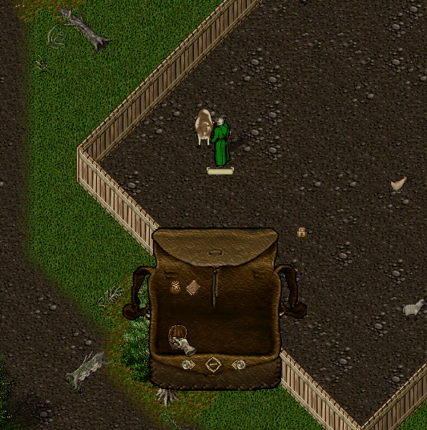

# 02.08.2026 Güncellemeleri

* Uncut gemstone ağırlıkları 3 den 2 ye düşürüldü
* Telchar's Might ın kesici bir aletle hasar alıp patlayabilmesi problemi düzeltildi. Mevcut eşyaların değişimi için yetkililerle iletişime geçebilirsiniz
* Craft Mastery 25 tamamlandığında üretim yapılan eşyaların hasar alma şansları 20 de 1 den 25 de 1 e düşürüldü
* Evlere ait kapıları linkleme özelliği aktif edildi. Kapılar linklendiği durumda yanında olan kapı ile birlikte açılacak. Linkleme işlemi sadece ev sahibi tarafından yapılabilir ve ücreti 25.000 altındır. Linki dilediğiniz zaman 25.000 altın karşılığında kaldırabilirsiniz

<figure><figcaption></figcaption></figure>

* Donatede yer alan büyülere Lightning büyüsü eklenmiştir. Toplam 6 farklı Lightning büyü efektini Donate sistemi üzerinden satın alabilirsiniz

<figure><figcaption></figcaption></figure>

<figure><figcaption></figcaption></figure>

* Donate sisteminde satın alınacak olan evlerin önizleme ekranları güncellendi. Artık satın alacağınız evin tasarımını Donate menüsü üzerinden daha detaylı görüntüleyebileceksiniz

<figure><figcaption></figcaption></figure>

* Donate sistemine 3 yeni ev eklendi. Bu evler Mid House kategorisinde yer alan Small Marble House with Patio, Medium Wood Cabin ve Medium Log Cabin. Evlere ait detaylı bilgilere Wiki sayfalarından ulaşabilirsiniz
* Profile dialogunda Recall büyü efekti satın alındığında efektsiz hale geri dönülememesi ile ilgili geliştirme yapıldı
* Profile dialoguna Lightning büyü efekti seçilebilmesi özelliği eklendi
* Olta ile tutulabilen balıklar arasına 5 Special, 2 Exotic Fish eklendi
* Yeni eklenen balıklar için Achievementlar eklendi
* Yeni eklenen Special Fish'ler Item Storage'a eklendi
* Yeni eklenen Special Fish'ler Gatherer görev sistemine dahil edildi
* Artan Special Fish sayısı nedeniyle fishing yeteneği ile alınan Gatherer görevlerinde Special Fish görev sayısı 4 den 3 e düşürüldü
* Blueprint Trader'a 7 yeni ev eklendi. Bu evlerden 3 tanesi Small House, 1 tanesi Medium House, 3 tanesi ise Large House kategorisinde. Evlere ait detaylı bilgilere Wiki sayfalarından ulaşabilirsiniz

<figure><figcaption></figcaption></figure>

* Farmer vendorda satılan tohum sayıları 3,5 den 3,4 e, fidan sayıları ise 1,2 den 1 e düşürüldü
* Farmer vendora 2 yeni fidan eklendi. Artık Cocoa ve Coconut ağaçları da ekebileceksiniz
* Farmer vendora 3 yeni tohum eklendi. Artık Ginger, Squash ve Sweet Potato da ekebileceksiniz
* Eklenen yeni tohumlar Gatherer görev sistemine dahil edildi
* Eklenen yeni tohum ve fidanlar için Achievementlar eklendi
* Eklenen yeni tohumlar ve mamülleri Item Storage'a eklendi
* Farming yeteneği için Beehive eklendi. Empty Beehive ları Farmer vendorlardan alıp arıları yetiştirip Jar of Honey elde edebilirsiniz

Beehive yerleştirebilmek için Farming yeteneğiniz 100 olmalı \
Beehive yapısı ağaçlar ile benzerlik göstermektedir. İlk yerleştirildiğinde 30 sağlık ile başlar ve 1 saat içerisinde sağlık durumu 50 ye çıkartıldığında kovan oğul vermekte ve bal üretim aşamasına geçmekte&#x20;

Eğer 1 saat sonunda sağlık durumu 50 ye çıkmazsa oğul verme aşaması baştan başlar&#x20;

<figure><figcaption></figcaption></figure>

Toplamda 2 defa oğul verme aşaması başarısız olursa kovan yok olur \
Kovan sağlığı su veya Honey Syrup verilerek arttırılabilir. Su sağlığı %10, Honey Syrup ise %20 arttırmakta \
Honey Syrup isimli eşyayı Farmer vendorlardan satın alabilirsiniz&#x20;

\
Honey Syrup hem oğul verme aşamasında, hem de bal verme aşamasında kullanılabilir. Bu aşamalarda ayrı ayrı ve en fazla 1 defa kullanılabilir. Su ise max 5 defa kullanılabilir. Süre kısaltma özelliği tohum ve fidanlar ile aynıdır \
3 saatin sonunda kovan bal verir. Kovan bal verdikten sonra balın 2 saat içerisinde toplanması gerekmektedir\
Toplama işlemi Sickle ile yapılabilir. Silver ve Gold sickle ile daha fazla mamül elde edebilirsiniz

* Beehive için Achievementlar eklendi
* Water Tub isimli eşyanın ismi Empty Tub olarak güncellendi
* Cook vendoruna Moulding Board eklendi. Bu eşya yardımı ile Cooking menüsünü açabilir ve yeni eklenen eşyaların üretimini sağlayabilirsiniz

<figure><figcaption></figcaption></figure>

* Cooking yeteneği için toplamda 32 adet üretilebilir eşya eklendi. Eşyaların üretimi için Blueprint <mark style="color:red;">**gerekmemekte**</mark>
* Cooking yeteneği ile eşya üretmek için bir ateş kaynağının yakınında olmanız gerekmekte
* Cooking eşyaları için Achievementlar eklendi
* Cooking yeteneği ile üretilen eşyalar Item Storage menüsüne eklendi
* Cooking yeteneği ile çeşitli eşyalar üretmek için Sweet Dough gerekmekte. Bu eşyayı üretmek için ise Pitcher of Milk gerekmekte

Pitcher of Milk Cook vendorlarda az miktarlarda satılmakta
\
Bunun yanı sıra Farmer vendorlardan satın alabileceğiniz Empty Tub ları haritada yer alan Cow lar üzerinde kullanarak Milk Tub elde edebilirsiniz


\
Elde edeceğiniz süt miktarı Animallore yeteneğinize göre artış gösterecektir. Eğer Animallore yeteneğiniz yoksa 10 litre, varsa 15 litreye kadar süt elde edebilirsiniz
\
Milk Tub'a doldurmuş olduğunuz sütleri Provis vendordan aldığınız Glass Pitcher lara doldurup eşya üretmeye başlayabilirsiniz

<figure><figcaption></figcaption></figure>


\
Milk Tub a çift tıkladıktan sonra Glass Pitcher seçerseniz o sürahiyi, kendinizi seçerseniz ise çantanızdaki Glass Pitcher lara süt doldurabilirsiniz

<figure><figcaption></figcaption></figure>

* İnek sağma işlemi için Achievementlar eklendi
* Carpenter menüye Wooden Bowl, Large Wooden Bowl ve Empty Tub eklendi. Bowl lar Cooking yeteneğinde Soup ve Salad üretimi için kullanılmakta, Empty Tub ise Farming yeteneğinde kullanılmakta
* Eklenen 3 yeni eşya için Achievementlar eklendi
* Şehirlere Dye Cabinet ler eklendi. Temel olarak Dye Creator Tool ile benzer şekilde çalışmakta. Burada hem üretim yapabilir, hem de mevcut renkleri görüntüleyebilirsiniz

<figure><figcaption></figcaption></figure>

* Rare Dye ların Tier yapıları güncellendi. Tier 3 boyalar Tier 4, Tier 2 boyalar Tier 3, Tier 1 boyalar ise Tier 2 olarak güncellendi. Üretimi için gereken eşyalarda herhangi bir değişiklik yapılmadı
* Cloth Dye için 4 adet yeni renk eklendi. Renkleri ve üretimleri için gereken eşya miktarlarını Dye Creator Tool veya Dye Cabinet lardan görüntüleyebilirsiniz

<figure><figcaption></figcaption></figure>

<figure><figcaption></figcaption></figure>

<figure><figcaption></figcaption></figure>

<figure><figcaption></figcaption></figure>

* Eklenen 4 rengin üretimi için Blueprint gerekmektedir. Blueprintleri hazinelerden elde edebilirsiniz
* Hair Dye üretimi ekranı güncellendi ve üretim tierlere ayrıldı. Ayrıca Tier 2 seviyesinde 7 yeni renk eklendi
* Eklenen 7 rengin üretimi için Blueprint gerekmektedir. Blueprintleri hazinelerden elde edebilirsiniz
* Beard Dye üretimi ekranı güncellendi ve üretim tierlere ayrıldı. Ayrıca Tier 2 seviyesinde 7 yeni renk eklendi
* Eklenen 7 rengin üretimi için Blueprint gerekmektedir. Blueprintleri dungeon chestlerden elde edebilirsiniz

Mevcut güncelleme ile birlikte toplam 79 yeni eşya ve Achievement eklendi
\
Bu güncelleme ile uzun süredir üzerinde çalıştığımız Cooking yeteneğini aktif etmiş bulunuyoruz
\
Bunun yanı sıra yeni evler, yeni üretim eşyaları, Farming yeteneğine 2 yeni yapı da eklemiş olduk

Q2 de yapacağımız geliştirme paketinin ilk aşamasını böylece aktif etmiş olduk.
\
Ağustos ayı içerisinde daha ufak güncellemeler ve yeni Wiki altyapısı üzerinde çalışıyor olacağız.
\
Eski wiki sistemini artık kullanmadığımız için güncelleme notları ve yeni sistemlere ait bilgiler yeni wiki adresimizde olacak. Şu an hala geçiş aşamasında olduğu için siteden yeni wikiye değil eskiye ulaşıma devam edeceksiniz. İsterseniz yeni wikiye alttaki linkten ulaşabilirsiniz



Eylül ayı itibari ile de Talep sistemi ve Guild görev sistemi üzerinde çalışmaya başlayacağız.

Umarım beklediğinize değen bir güncelleme olmuştur.
