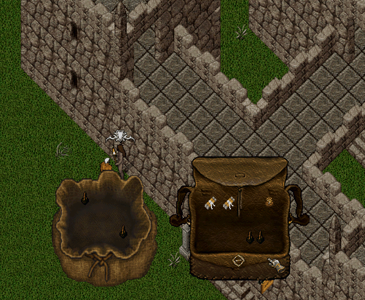

# 31.08.2026 Güncellemeleri

* Terathan Keep bölgesinde tek noktada chest spawn olması ile alakalı problem düzeltildi. Artık tüm dungeonlar gibi yaklaşık 15 farklı noktada ve aynı anda 3 adet chest spawn olabilecek
* Ev vendorunda toplu fiyatlandırmanın sadece vendorun çantasında en üstte yer alan eşyalarda çalışması problemi düzeltildi

<figure><figcaption></figcaption></figure>

Artık bir eşyayı fiyatlandırdığınızda eşyanın bulunduğu konteynerde aynı eşyadan varsa sadece o konteynerdeki eşyalar sorulacak ve fiyatları değiştirilebilecek

* Günlük görev sistemi bu gece 00:00 itibari ile aktif olacaktır
