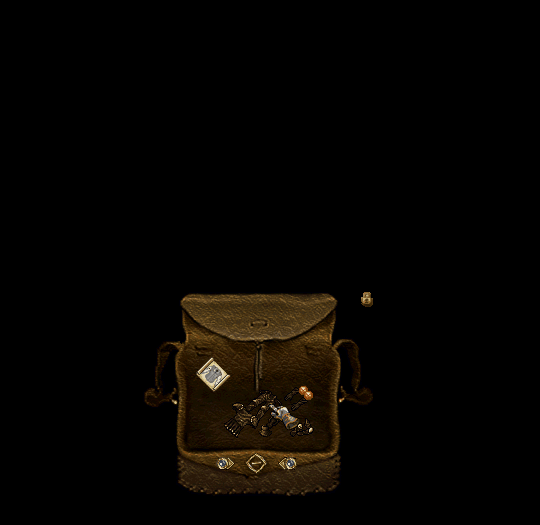
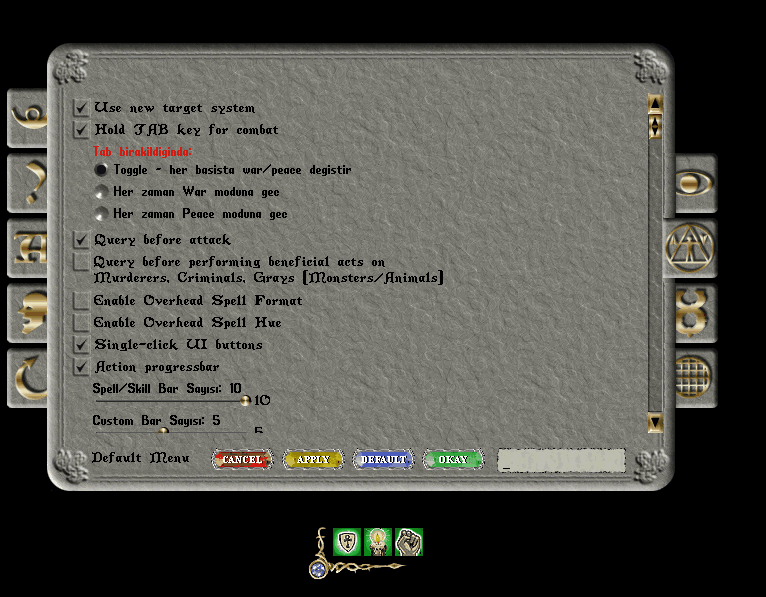
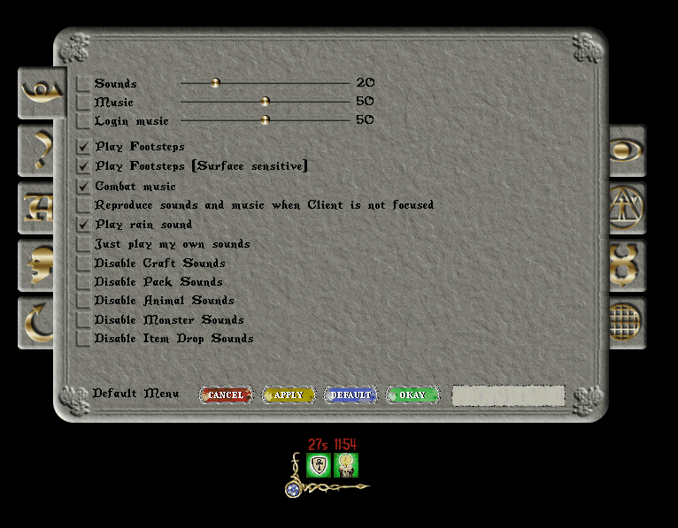

# 08.10.2026 Güncellemeleri

* Bineklerin Deed haline getirilirken üzerlerinde stat büyüsü olması sebebiyle statlarının kalıcı azalması problemi düzeltildi
* Saat 19:15 ve 21:15 de başlayan oto etkinlikler 19:30 ve 21:30 olarak güncellendi
* Hay fiyatı 3 gp den 300gp ye yükseltildi
* Full spellbook üretiminde bazı durumlarda yaşanabilen problem düzeltildi
* Fishing net üretimi için artık <mark style="color:red;">**5 Craft XP**</mark> istemekte
* Gatherer Apron'un <mark style="color:red;">**newbified özelliği kaldırıldı**</mark> ve üretimi için gereken eşyalar güncellendi. Artık üretim için 2 Magic Cloth değil 1 Magic Cloth gerekmekte
* Gatherer Apron'un superior olması durumunda verdiği ek taşıma kapasitesi 100 den 125 e yükseltildi
* Elven Bow efektif range i 2,12 den 2,14 e güncellendi
* Tüm Mastery dialoglarına hangi seviyede ne ödül alınacağı ile ilgili detay bilgileri eklendi. Ödüller sekmesinde ödülün üzerine gelerek ödüllerle ilgili detaylı bilgilere ulaşabilirsiniz

<figure><figcaption></figcaption></figure>

<figure><figcaption></figcaption></figure>

<figure><figcaption></figcaption></figure>

<figure><figcaption></figcaption></figure>

* Sipariş sisteminde Potion sekmesi aktif edildi

Tek siparişte en fazla <mark style="color:red;">**250 adet**</mark> eşya sipariş verebilirsiniz Girmiş olduğunuz rakam tek bir eşya için değil siparişin tamamı için geçerlidir

* Player vendorlarda binek ve Blueprint satışı için toplu fiyatlandırma aktif edildi

Binekler için Mustang, Shire, Ice Ostard gibi birden fazla rengi olan binekler toplu fiyatlandırılmamakta\
Blueprint için o çantada yer alan aynı Blueprintler toplu fiyatlandırılabilmekte

* Armor Bundler çalışma mantığı güncellendi. Artık tüm parçaları eklemek yerine otomatik ekleme işlemi yapabileceksiniz

İlk parça eklendikten sonra Kalanları Ekle butonu aktif olacak. Bu botuna tıkladığınızda çantanızda o set parçasına ait tüm parçalar alınacak\
Eğer tüm parçalar eklenmiş ise Bundle Yap butonu aktif olacak ve Bundle yapabileceksiniz

<figure><figcaption></figcaption></figure>

* Achievement sisteminin detay ekranı güncellendi

Artık detay ekranında her bir seviyeyi tamamlamak için ne yapılması gerektiği ve seviye tamamlandığında ne ödüller alındığını görebileceksiniz \
PvM sekmesinde 3. seviye tamamlandığında alacağınız Title ödülünü de artık görüntüleyebileceksiniz

<figure><figcaption></figcaption></figure>

* Achievement filtre ekranı güncellendi

Artık seçili olan kategoriye göre alt filtrelemeler de yapabileceksiniz\
<mark style="color:red;">**Craft kategorisinde**</mark> Alchemy, Blacksmith, Bowcraft, Carpenter, Cooking, Housecraft, Inscription, Masonry, Shipcraft, Tailor ve Tinker alt kırılımları bulunmaktadır&#x20;

<figure><figcaption></figcaption></figure>

<mark style="color:red;">**PvM kategorisinde**</mark> Arachnids, Beasts, Champions, Demons, Dragonkind, Elementals, Fey, Giants, Goblins, Orcs, Reptiles ve Undead alt kırılımları bulunmaktadır

<figure><figcaption></figcaption></figure>

<mark style="color:red;">**Gatherer kategorisinde**</mark> Farming, Fishing, Lockpicking, Lumberjacking, Mining ve Rare Flower alt kırılımları bulunmaktadır&#x20;

<figure><figcaption></figcaption></figure>

Bu alt kategorileri seçerek aradığınız Achievementları çok daha hızlı bulabilirsiniz

* Achievement Tracker için öneri yapısı eklendi

.achi yazdığınızda açılan Tracker ekranının sol üstündeki butona basarak <mark style="color:red;">**500k karşılığında**</mark> tamamlamaya en yakın olduğunuz Achievementları görüntüleyebilir ve takip listesine alabilirsiniz

Komut kullanıldıktan sonra 1 saat boyunca listeyi istediğiniz zaman tekrar görüntüleyebilirsiniz

<figure><figcaption></figcaption></figure>

* Blueprint Trader artık Blueprint Vendor olarak görev hayatına devam edecek
* Blueprint Vendor artık hem Blueprint takaslayacak, hem satış yapacak, hem de sizden Blueprint alabilecek
* Trade kısmında hala 5 blueprint ve 50.000 altın vererek 20 Blueprintten birini alabilirsiniz. Eskisinden farklı olarak <mark style="color:red;">**artık Rare Dye lara ait blueprintleri de kabul etmekte**</mark>

<figure><figcaption></figcaption></figure>

* Satın Al kısmında Alchemy, Blacksmith, Carpenter, Tailor, Tinker, Shipcraft ve Housecraft için toplamda 12 adet Blueprint satışı yapacak

Blueprintler stokları 18-24 saatleri arasında rastgele sıfırlanacak ve her Blueprint'ten 1 adet satışa sunulacak \
Her yetenekten yalnızca 1 adet Blueprint satın alabileceksiniz. Blueprint'e ait stok bittiğinde solda Tükendi yazısını göreceksiniz \
Ayrıca sahibi olduğunuz Blueprintler yeşil olarak görüntülenecek Blueprint fiyatları 300-500k arasında rastgele olarak belirlenmekte

<figure><figcaption></figcaption></figure>

* Satış ekranında ise sahip olduğunuz Blueprintleri 150 Craft XP karşılığında vendora verebileceksiniz

<figure><figcaption></figcaption></figure>

* Hazine haritasında Zoom In/Zoom Out butonuna bilgi mesajı eklendi

<figure><figcaption></figcaption></figure>

* Buff Duration için çeşitli özelleştirme seçenekleri eklendi

Artık Buff Icon boyutu, kalan süre boyutu ve kalan süre rengini istediğiniz gibi ayarlayabileceksiniz

<figure><figcaption></figcaption></figure>

* Düşük HP'de ekran kenarında kırmızı vinyet seçeneği artık özelleştirilebilir

Ayarlarınızı yaptıktan sonra altta yer alan Önizle butonuna tıklayarak ekranda nasıl görüntüleneceğini görebilirsiniz&#x20;

<figure><figcaption></figcaption></figure>

Bildiğiniz gibi 31 Ekim 2025 tarihinde kapılarımızı siz oyunculara açtık. 1 yılımızı çeşitli ingame ödüller ve etkinlikler ile kutlayacağız \
Yakın zamanda gerekli bilgilendirmeyi yapacağız
