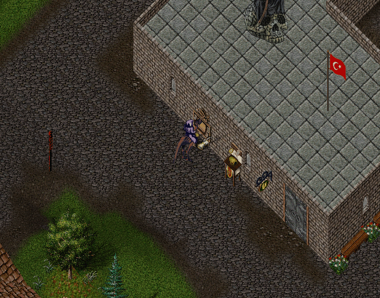

# 21.09.2026 Güncellemeleri

* Necklace of Spellchant, Bracelet of Clarity ve Bracelet of Endurance eskime şansları azaltıldı
* Necklace of Spellchant giyildiğinde 5 armor verecek
* Hood'un hitpoints i arttırıldı ve giyildiğinde 5 armor verecek
* Magic Cloth ve Wizard Cloth üst üste binebilir olacak şekilde güncellendi
* Wand üretimi için gereken Blueprint zorunluluğu kaldırıldı
* Wand Blueprint'i Carpenter görev ödül listesinden çıkartıldı
* Tier 2 ve Tier 1 yaratıklar artık ilk sayfa büyülerinden etkilenmeyecek
* Günlük görev sisteminde verilecek minimum görev rakamları güncellendi

Tier5 için min-max rakamları 13,26 dan 20,26 ya yükseltildi \
Tier4 için min-max rakamları 8,16 dan 12,16 ya yükseltildi \
Tier3 için min-max rakamları 5,10 dan 7,10 a yükseltildi \
Tier2 için min-max rakamları 3,6 dan 5,6 ya yükseltildi \
Tier1 için min-max rakamları 2,4 den 3,4 e yükseltildi \
Güncelleme öncesinde bir günde alınabilecek min-max puan miktarı 1000-2000 arasındaydı. Güncelleme sonrasında bu rakam 1500-2000 arasında olacak

* Günlük görev sistemine Cumartesi günleri ek bir görev eklenecek. Bu görev World Boss' a hasar verme görevi olacaktır

World Boss a verdiğiniz hasarın %20 kadarı puan olarak eklenecektir. World Boss hasarı ile kazanabileceğiniz max puan 1000 olacaktır

* Guildwars sisteminde Last Stand modu için 2 yeni ayar eklendi

Bandaj sayısı seçimi ile savaşa girişte kaç adet bandaj alacağınızı seçebilirsiniz. Önceden bu rakam (katılımcı sayısı \* 5) şeklindeydi. Ayrıca seçilen (bandaj sayısı / 5) adet Salve bandaj alacaksınız\
Ölünce Binek ver seçimi aktif edildiğinde her reslendiğinizde çantanıza 1 adet Horse verilecek. Etkinliğine girdiğiniz bineğe bindiğinizde bu Horse silinecek

<figure><figcaption></figcaption></figure>

* Guildwars sisteminde Team Deathmatch modu için 1 yeni ayar eklendi

Bandaj sayısı seçimi ile savaşa girişte kaç adet bandaj alacağınızı seçebilirsiniz. Önceden bu rakam (katılımcı sayısı \* 5) şeklindeydi. Ayrıca seçilen (bandaj sayısı / 5) adet Salve bandaj alacaksınız

<figure><figcaption></figcaption></figure>

* Warzone etkinliği sona erdiğinde kazanan ve kaybeden tarafa Victory ve Defeat bilgisi daha net verilecek

<figure><figcaption></figcaption></figure>

* Warzone etkinliği tamamlandığında gelen savaş analizi ekranı güncellendi ve Puan alanı eklendi

<figure><figcaption></figcaption></figure>

Önceki yapıda sıralama sadece verilen hasar miktarına göre yapılmaktaydı Güncelleme sonrası Puan hesaplaması şu şekildedir: ( Kill \* 100 ) + ( Verilen Hasar / 2 ) + ( Res Sayısı \* 50 ) + ( Heal Miktarı / 5 ) + ( Alınan Hasar / 5 ) - ( Ölüm Sayısı \* 50 )

<figure><figcaption></figcaption></figure>

* Sipariş sistemi aktif edildi

Bankalarda yer alan Sipariş Panoları yardımı ile satın almak istediğiniz eşya için sipariş oluşturabilirsiniz \
Kapsamlı bir sistem olduğu için şu anlpha aşamasındadır ve şu an için sadece Silah sekmesi aktif olarak çalışmaktadır. İlerleyen zamanlarda diğer eşyalar da aktif edilecektir \
Silah seçimi yaptıktan sonra silah seviyesi(Vanq, Power, Force) ve ek kriter seçimi ( Hasarsız, Tamir Edilmemiş, Item ID yapılmamış ) yaparak satın almak istediğiniz silah için sipariş oluşturabilirsiniz\
Sipariş oluşturulduğunda satın almak istediğiniz fiyat üzerinden %10 komisyon kesilecektir \
Aynı anda en fazla 5 adet sipariş oluşturabilirsiniz. Premium oyuncular için bu rakam 10 adettir Siparişler sekmesinden açık siparişleri görüntüleyebilir, eşya satışı yapabilirsiniz \
Siparişlerim sekmesinde ise oluşturduğunuz tüm siparişleri görüntüleyebilirsiniz \
Sisteme ait detaylı bilgiye wiki sayfasından ulaşabilirsiniz

<figure><figcaption></figcaption></figure>
