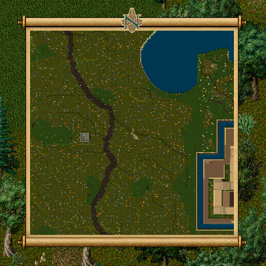

# 15.06.2026 Güncellemeleri

* Bandaj kullanımında yükseklik ile ilgili kontroller güncellendi. Kullanım sırasında 8 olan yükseklik farkı kontrolü 15'e çıkartıldı. Bandaj etkisi uygulandığı sırada olan yükseklik kontrolü tamamen kaldırıldı
* Düello sisteminde çeşitli hata düzeltmeleri ve iyileştirmeleri yapıldı
* Hazine haritalarının yapısı güncellendi. Artık hazine haritaları çözüldüğünde eskisine göre çok daha büyük bir alanda görüntülenecek (soldaki eski, sağdaki yeni hali) 

<figure><figcaption></figcaption></figure>

* Hazine haritası açıldığında dialogdaki buton yardımı ile hazine konumunun Zoom seviyesini ayarlayabileceksiniz. 3 farklı zoom seviyesi arasında geçiş yapabilirsiniz

<figure><figcaption></figcaption></figure>

* Duskmare için Achievement rakamları 1,10,200 den 1,5,100 e güncellendi
* Discordance yeteneğinin altyapısı güncellendi. Artık yetenek Musicianship yeteneğine ihtiyaç duymadan çalışmakta.

Önceki yapıda oyuncunun yaratıkları efektif olarak mayıştırabilmesi için 40-50 arası bir Musicianship yeteneğine ihtiyaç duyulmaktaydı. Artık yetenek tamamen bağımsız olarak çalışmakta

* World Map'e kullanım kolaylığı açısından 2 yeni buton eklendi. Solda yer alan Follow butonuna tıklayarak haritanın sizi takip etmesini veya etmemesini aktif edebilirsiniz. Sağda yer alan Rooms butonu ile de hızlı bir şekilde oda kurabilir veya kurulu bir odaya katılabilirsiniz

<figure><figcaption></figcaption></figure>

* World Map'de aynı odadaki oyuncularda zehir etkisi olması durumunda HP Bar'ın yeşil olarak gözükmesi eklendi
* Fire Dungeon bölgesinde çeşitli harita iyileştirmeleri yapıldı
* Hythloth bölgesinde çeşitli harita iyileştirmeleri yapıldı

Problem yaşamamak adına bağlantı programını tamamen kapatıp güncellemeleri indirmeniz gerekmektedir
