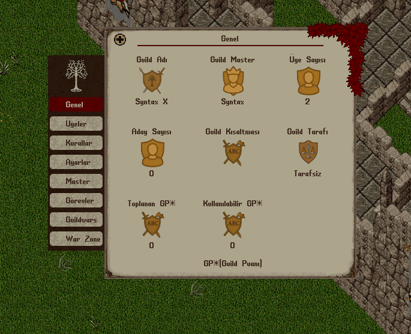

# 30.06.2026 Güncellemeleri

* Britain bölgesinde bulunan tarla artan talep sebebiyle genişletildi
* Wrong ve Hythloth zindanlarında West yönüne doğru açılan kapılar güncellendi. Artık kapılar East yönüne doğru açılacak ve oyuncuların geçişini engellemeyecek
* Tinkering yeteneği kullanımında animasyon ve ses eklendi
* Hair Stylist vendordaki bir problem düzeltildi. Ayrıca saç ve sakal seçimi önizleme menüsünde karakter rengi gözükecek şekilde güncelleme yapıldı
* Duyuru, Page ve bildirimlerde tarihin daha doğru gösterilmesi için güncellemeler yapıldı
* World map'te Follow veya Rooms butonlarına basıldığında mouse un takılı kalması problemi düzeltildi
* Guildler için bayrak seçimi tamamen ücretsiz hale getirildi. Kullanımda herhangi bir süre bulunmamakta. Bayrak seçiminde sorun yaşıyorsanız yetkililer ile iletişime geçebilirsiniz
* War Zone sisteminde artık yapılan tüm savaşların detay bilgileri tutulmakta. War Zone sekmesindeki Son Karşılaşmalar butonu üzerinden guildinizin yaptığı son 15 karşılaşmaya ait detay bilgilerine ulaşabilirsiniz

Detay bilgilerinde hangi guild ile savaşıldığı, kimin kazandığı, savaş türü ve savaş süresi bilgilerine ulaşabilirsiniz

<figure><figcaption></figcaption></figure>

<figure><figcaption></figcaption></figure>

<figure><figcaption></figcaption></figure>

<figure><figcaption></figcaption></figure>

* War Zone sisteminde yer alan Team Deathmatch aktif edilmiştir.

Team Deathmatch Last Stand'den farklı olarak tüm oyuncuların ölmesi durumunda değil belirlenen rakama ulaşıldığında bitmektedir. \
Oyuncular öldüklerinde başlangıç noktalarına gönderilirler ve etkinlik için verilen eşyaları tekrar verilir. \
Savaş alanına tekrar katılmak için 30 saniye süreniz bulunmaktadır. \
Belirlenen rakama ulaşıldığında savaş sona erer. \
Loot mevcutsa kaybeden guildin tüm oyuncuları sistem tarafından öldürülür.\
Bu etkinlikte ölüm sonrası potion ve bandaj gibi eşyalar baştan verileceği için seçilebilecek Potion miktarı Last Stand'e göre daha düşüktür.\
Her oyuncu ölümünde mevcut skor oyunculara duyurulur.\
Ayrıca .skor komutu ile mevcut skor görüntülenebilir. \
Scoreboard ekranında guild lerin bayrakları ve skor bilgisi bulunmaktadır.\
Sistem hala geliştirme aşamasındadır ve şu an için sadece Britain şehri aktiftir. \
Kullanım öncesinde yetkililer ile iletişime geçiniz

<figure><figcaption></figcaption></figure>

<figure><figcaption></figcaption></figure>
