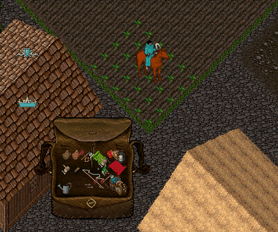

# 25.04.2026 Güncellemeleri

* Craft Mastery sisteminde max seviye 20 den 25 e yükseltildi. Bu yükseltme sonrasında 20+ seviyeler için verilecek ödüller şu şekildedir;

Level 21: Superior Üretim -> Üretilen eşyalar normal eşyalara göre %25 daha dayanıklı olacaktır Level 22: Mallet and Chisel -> StoneCrafting ile bir çok görsel eşya üretimi yapabileceksiniz \
Level 23: Çift Üretim -> Eşya üretirken %10 şansla aynı eşyadan 2 adet üretebilirsiniz \
Level 24: Gem Üretimi -> Mining Vein lerden elde edebileceğiniz Gem Stone ları keserek çeşitli eşyalar üretebilirsiniz \
Level 25: Hatasız Üretim -> Eşya üretirken fail almadan %100 şansla eşya üretimi yapabileceksiniz

<figure><figcaption></figcaption></figure>

* Gatherer Mastery sisteminde max seviye 20 den 25 e yükseltildi. Bu yükseltme sonrasında 20+ seviyeler için verilecek ödüller şu şekildedir; ( Resim 2 )

Level 21: Gem Bulma Şansı -> Gold Pickaxe kullanarak Mining Veinlerden Gem Stone lar elde edebilirsiniz \
Level 22: Verimli Kullanım -> Kullandığınız eşyalar daha zor eskiyecek. Mining Vein ve Tree Grove kazımında eşyanın hasar alma şansı %100 den %50 ye düşecek \
Level 23: Toplu Sulama -> Watering Can kullanarak Farming yeteneğinde 2 kare etrafınızdaki bitkileri otomatik sulayabileceksiniz \
Level 24: Kusursuz Toplama -> Gather işlemlerinde %100 şansla eşya toplayabileceksiniz \
Level 25: Hızlı Toplama -> Mining, Fishing ve Lumberjacking işlemleri sırasında 3 defa hareketi yapmak yerine 2 defa yapacaksınız. Eşya toplama süresi %33 azalacak 

<figure><figcaption></figcaption></figure>

* Craft görevlerinden elde edilebilecek Blueprintler güncellendi. Bu güncelleme sonrasında

Tinkering yeteneği için 6, \
Carpentry yeteneği için 9, \
Blacksmith yeteneği için 8 adet yeni eşya craft görevlerinden elde edilebilmekte

* Wand üretimi için Tinker menüye Silver Wire eklendi. Parts sekmesinde yer almakta
* WandCrafting aktif edildi. Carpenter görevlerinden elde edebileceğiniz Blank Wand blueprinti ile Blank Wand üretip sonrasında Inscription yeteneği ile Wand üretebilirsiniz.

Üretilen Wand lar 10-15 şarj arası olacaktır. Kullanımı sırasında mana kullanmadan Wand ile büyü yapabilmektesiniz. Wand kullanımı için Hunter Mastery seviyeniz 11 ve üzeri olmalıdır.

<figure><figcaption></figcaption></figure>

* Craft menüsüne bir çok yeni eşya üretimi eklendi. Bu eşyaların bir kısmı Blueprint ile üretilirken bir kısmı ile Blueprint olmadan da üretilebilecek

<figure><figcaption></figcaption></figure>

<figure><figcaption></figcaption></figure>

* StoneCrafting aktif edildi. Eşya üretimi için Craft Mastery seviyesi 22 yi tamamladığınızda Mallet and Chisel elde edeceksiniz. Bu eşyaya çift tıklayarak Granite Stone lar ile çeşitli eşyalar üretebilirsiniz

<figure><figcaption></figcaption></figure>

* Gem Cutting aktif edildi. Mining Vein lerden Gold Pickaxe ile elde edebileceğiniz Gem Stone ları Jeweler vendorların binalarında yer alan Gem Cutting Table kullanarak kesebilir ve çeşitli eşyalar üretebilirsiniz.
*   Tinkering menüsüne 4 yeni eşya eklendi. Bu eşyaların üretimi için Blueprint ve Gemstone gerekmekte

    Night Eye -> Takan oyuncuya Nightsight etkisi verir. Kullanım sırasında eskir ve kırılır \
    Necklace of SpellChant -> Büyü sözlerini Runik olarak kullanmanızı sağlar. Sadece Mage karakterler tarafından kullanılır ve kullanımı sırasında eskir ve kırılır \
    Bracelet of Clarity -> Takan oyuncuya pasif olarak 3 saniyede +3 mana verir. Tüm oyuncular tarafından kullanılabilir. Kullanımı sırasında eskir ve kırılır \
    Bracelet of Endurance -> Takan oyuncuya pasif olarak 3 saniyede +1 stamina verir. Tüm oyuncular tarafından kullanılabilir. Kullanımı sırasında eskir ve kırılır

<figure><figcaption></figcaption></figure>

* Wizard Robe ve Faster Casting Robe un pasif olarak mana verme özelliği kaldırıldı
* Donate menüsüne Lantern toplam 16 Lantern den oluşan Blueprint Bundle eklendi

<figure><figcaption></figcaption></figure>

* Lantern tipli eşyaların eve sabitlendikten sonra yanar durumdayken Flip komutu ile dönmemesi ile ilgili problem düzeltildi. Artık eşyalar yanıkken de döndürülebilecek
* v2 client ile oyuna girişler tamamen kapatıldı. Artık sadece v3 client ile oyuna giriş yapabileceksiniz.
* Tinker menüye Watering Can eklendi. Üretimi için 5 Iron Ingot ve 10 Silver Ingot gerekmekte. Ayrıca üretimi için Blueprint gerekmekte. Blueprint'i Tinker yeteneğine ait görevleri tamamlayarak elde edebilirsiniz

<figure><figcaption></figcaption></figure>

Watering Can Farming yeteneği için kullanılmakta ve eşyaları tek tek sulamanın yanı sıra 2 kare etrafınızda size ait bitkileri sulamak için de kullanılabilmekte.

<figure><figcaption></figcaption></figure>

* Madenin efendisi etkinliğinde kazananın belirlenmesi ile alakalı problem düzeltildi
* Farmer vendora Blueberry, Blood Moss ve Lemon olmak üzere 3 yeni tohum eklendi.
* Item Storage'a yeni seed ve harvestler eklendi
* Yeni eklenen eşyalar ve tohumlar için Achievementlar aktif edildi
* Silver Platemail için hatalı Achievement rakamları düzeltildi
