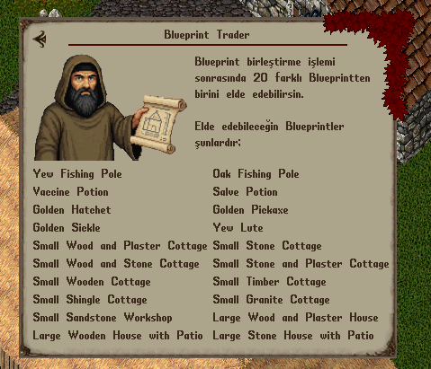

# Blueprint Sistemi

Nimloth dünyasında artık ustalığın sınırlarını çizen bir yenilik sizleri bekliyor!

Yeni Blueprint Sistemi, oyunculara sıradan üretimin ötesine geçme ve efsanevi eşyaların gizli tasarımlarını keşfetme imkânı sunuyor.

### Blueprint Nedir?

Blueprintler, belirli eşyaların üretimi için gerekli olan özel taslaklardır.

Bazı eşyaları üretmek için sadece zanaat yeteneğiniz yeterli olmayabilir, aynı zamanda o eşyanın blueprint’ine de sahip olmanız gerekir.

### Blueprint Gerektiren Eşyalar

Bir eşya üretmek istediğinizde, eğer o eşya bir blueprint gerektiriyorsa, üretim menüsünün sağ üst köşesinde bir kilit (🔒) simgesi göreceksiniz.

Bu, o eşyayı üretebilmek için ilgili blueprinti öğrenmeniz gerektiği anlamına gelir.

### Blueprint Kullanımı

Bir blueprint üzerine tek tıkladığınızda, bu Blueprint'in hangi eşyaya ait olduğunu görebilirsiniz.

Çift tıkladığınızda ise bir dialog açılır. Bu pencerede Blueprint'in hangi eşyaya ait olduğunu görüntüleyebilir ve Blueprint'i öğrenebilirsiniz.

Onayı verdiğinizde blueprint’i kalıcı olarak öğrenmiş olursunuz ve artık o eşyayı dilediğiniz zaman üretebilirsiniz.

Blueprint’i öğrendikten sonra, artık o tasarıma ait kilit ortadan kalkar..

Üretim menüsünde yer alan kilit simgesi kaybolur ve eşya, gerekli malzemeleriniz varsa doğrudan üretilebilir hale gelir.

<figure><figcaption></figcaption></figure>

### Blueprint Nasıl Elde Edilir?

Blueprintleri Nimloth dünyasında birçok farklı yolla elde edebilirsiniz:

• Craft görevlerini tamamlayarak

• Deniz Ticaret yaparak

• Hazine sandıklarını açarak

• Dungeon sandıklarını (chest) keşfederek

• Blueprint Trader vendoru ile takas yaparak

• Blueprint Combiner ile birleştirme işlemi yaparak

• Donate sistemi üzerinden ödül olarak

Her biri farklı türde blueprintler kazanmanızı sağlar.

### Blueprint Koleksiyonu Görüntüleme

Nimloth dünyasında edindiğiniz tüm blueprintleri artık tek bir yerden takip edebilirsiniz.

[<mark style="color:red;">**Profile**</mark>](https://nimloth-uo.gitbook.io/wiki/sistemler/oyuncu-profili-sistemi#blueprintler-yalnizca-premium-oyuncular-icin) menüsünde yer alan <mark style="color:red;">**Blueprintler**</mark> sekmesi, sunucuda bulunan tüm blueprintlerin listesini içerir.

Sahip olduğunuz blueprintler orijinal renkleriyle görüntülenirken, henüz edinmediğiniz blueprintler gri renkte ve sağ üstlerinde kilit simgesiyle gösterilir.

Ayrıca blueprintleri yetenek türlerine göre filtreleyebilir, böylece koleksiyonunuzda hangi taslakların eksik olduğunu kolayca görebilirsiniz.

Bu özel sekmeye yalnızca [<mark style="color:red;">**premium üyeler**</mark>](https://nimloth-uo.gitbook.io/wiki/sistemler/premium-sistemi) erişebilir.

<figure><figcaption></figcaption></figure>

## Blueprint Trader

Nimloth dünyasında blueprint geliştirme süreci Blueprint Trader vendorları aracılığıyla gerçekleştirilebilmektedir.

Oyuncular mevcut blueprintlerini daha üst seviyeye çıkararak daha değerli tasarımlara ulaşma fırsatı bulurlar.

Britain ve Minoc şehirlerinde bulunan Blueprint Trader vendorlarına giderek birleştirme işlemini yapabilirsiniz.

Trader, bu işlem için sizden 5 adet Blueprint ve 50.000 altın talep edecektir.

Bu işlem gerçekleştirildiğinde, altta yer alan <mark style="color:red;">**20 Blueprint'den birini**</mark> elde edebilirsiniz.

• [<mark style="color:red;">**Yew Fishing Pole**</mark>](https://nimloth-uo.gitbook.io/wiki/esyalar/uretimtoplayici/yew-fishing-pole)

• [<mark style="color:red;">**Oak Fishing Pole**</mark>](https://nimloth-uo.gitbook.io/wiki/esyalar/uretimtoplayici/oak-fishing-pole)

• [<mark style="color:red;">**Vaccine Potion**</mark>](https://nimloth-uo.gitbook.io/wiki/esyalar/iksirler/vaccine-potion)

• [<mark style="color:red;">**Salve Potion**</mark>](https://nimloth-uo.gitbook.io/wiki/esyalar/iksirler/salve-potion)

• [<mark style="color:red;">**Golden Hatchet**</mark>](https://nimloth-uo.gitbook.io/wiki/esyalar/uretimtoplayici/gold-hatchet)

• [<mark style="color:red;">**Golden Pickaxe**</mark>](https://nimloth-uo.gitbook.io/wiki/esyalar/uretimtoplayici/gold-pickaxe)

• [<mark style="color:red;">**Golden Sickle**</mark>](https://nimloth-uo.gitbook.io/wiki/esyalar/uretimtoplayici/gold-sickle)

• [<mark style="color:red;">**Yew Lute**</mark>](https://nimloth-uo.gitbook.io/wiki/esyalar/diger-esyalar/yew-lute)

• [<mark style="color:red;">**Small Wood and Plaster Cottage**</mark>](https://nimloth-uo.gitbook.io/wiki/yapilar/evler/small-houses/small-wood-and-plaster-cottage)

• [<mark style="color:red;">**Small Stone Cottage**</mark>](https://nimloth-uo.gitbook.io/wiki/yapilar/evler/small-houses/small-stone-cottage)

• [<mark style="color:red;">**Small Wood and Stone Cottage**</mark>](https://nimloth-uo.gitbook.io/wiki/yapilar/evler/small-houses/small-wood-and-stone-cottage)

• [<mark style="color:red;">**Small Stone and Plaster Cottage**</mark>](https://nimloth-uo.gitbook.io/wiki/yapilar/evler/small-houses/small-stone-and-plaster-cottage)

• [<mark style="color:red;">**Small Wooden Cottage**</mark>](https://nimloth-uo.gitbook.io/wiki/yapilar/evler/small-houses/small-wooden-cottage)

• [<mark style="color:red;">**Small Timber Cottage**</mark>](https://nimloth-uo.gitbook.io/wiki/yapilar/evler/small-houses/small-timber-cottage)

• [<mark style="color:red;">**Small Shingle Cottage**</mark>](https://nimloth-uo.gitbook.io/wiki/yapilar/evler/small-houses/small-shingle-cottage)

• [<mark style="color:red;">**Small Granite Cottage**</mark>](https://nimloth-uo.gitbook.io/wiki/yapilar/evler/small-houses/small-granite-cottage)

• [<mark style="color:red;">**Small Sandstone Workshop**</mark>](https://nimloth-uo.gitbook.io/wiki/yapilar/evler/medium-houses/small-sandstone-workshop)

• [<mark style="color:red;">**Large Wood and Plaster House**</mark>](https://nimloth-uo.gitbook.io/wiki/yapilar/evler/large-houses/large-wood-and-plaster-house-with-patio)

• [<mark style="color:red;">**Large Wooden House with Patio**</mark>](https://nimloth-uo.gitbook.io/wiki/yapilar/evler/large-houses/large-wooden-house-with-patio)

• [<mark style="color:red;">**Large Stone House with Patio**</mark>](https://nimloth-uo.gitbook.io/wiki/yapilar/evler/large-houses/large-stone-house-with-patio)

Ayrıca Blueprint Trade vendorunda yer alan <mark style="color:red;">**"İnfo"**</mark> butonuna tıklayarak da bu listeye ulaşabilirsiniz

<figure><figcaption></figcaption></figure>

### ÖNEMLİ NOT

Birleştirme işleminde bazı blueprint türleri kabul edilmez.

<mark style="color:red;">**Her türlü Dye kategorisindeki özel Blueprintler sistem tarafından reddedilir ve birleştirme sürecinde kullanılamazlar.**</mark>

## Blueprint Combiner

Blueprint Combiner, hazine avlarından elde edilebilen özel bir üretim eşyasıdır.

Bu eşya sayesinde, elinizde biriken fazla blueprintleri bir araya getirerek yeni ve farklı bir blueprint elde edebilirsiniz.

Sistemin amacı, değer kazandırmakta zorlanan düşük seviye blueprintlerin anlamlı bir şekilde değerlendirilmesini sağlamaktır.

### Nasıl Çalışır?

Yeni bir blueprint üretmek için <mark style="color:red;">**6 adet blueprint**</mark> eklemeniz gerekmektedir.

Blueprint eklemek için <mark style="color:red;">**"+"**</mark> butonuna tıklayarak Blueprintleri tek tek ekleyebilir veya <mark style="color:red;">**"Çantadan Al"**</mark> butonuna basarak çantanızda bulunan tüm Blueprintleri otomatik olarak ekleyebilirsiniz.

### Blueprint Çıkartma

Eklenen Blueprintler gerektiğinde çıkarılabilir.

Bunun için, listede yer alan Blueprintin yanındaki <mark style="color:red;">**"X"**</mark> butonuna tıklamak yeterlidir. Bu şekilde Blueprint anında listeden kaldırılır.

### Birleştirme İşlemi

6 adet blueprint eklendikten sonra <mark style="color:red;">**"Birleştir"**</mark> butonuna tıklayarak yeni bir Blueprint elde edebilirsiniz.

Sistem tüm Blueprintleri değerlendirir ve oyuncuya 36 adet Blueprintten birini rastgele olarak verir.

Bu işlem Blueprintlerin geri dönüşümünü sağlar ve oyuncuların farklı üretim tarifleri elde etmesine yardımcı olur.

<figure><figcaption></figcaption></figure>

**Nimloth dünyasında bulunan Blueprintler ve elde edebileceğiniz yerler şu şekildedir:**

## **Alchemy**

Alchemy yeteneği için <mark style="color:red;">**76 adet**</mark> Blueprint bulunmaktadır.

| Eşya                   | Elde Edildiği Yer                             |
| ---------------------- | --------------------------------------------- |
| Cloth Dye (11 Adet)    | Treasure Chest, Blueprint Vendor              |
| Furniture Dye (7 Adet) | Treasure Chest, Blueprint Vendor              |
| Ship Dye (7 Adet)      | Treasure Chest, Blueprint Vendor              |
| Hair Dye (14 Adet)     | Treasure Chest, Blueprint Vendor              |
| Leather Dye (7 Adet)   | Dungeon Chest (Level 2 - 3), Blueprint Vendor |
| Golem Dye (7 Adet)     | Dungeon Chest (Level 2 - 3), Blueprint Vendor |
| House Dye (7 Adet)     | Dungeon Chest (Level 2 - 3), Blueprint Vendor |
| Beard Dye (14 Adet)    | Dungeon Chest (Level 2 - 3), Blueprint Vendor |
| Salve Potion           | Blueprint Trader, Blueprint Vendor            |
| Vaccine Potion         | Blueprint Trader, Blueprint Vendor            |

## Blacksmith

Alchemy yeteneği için <mark style="color:red;">**75 adet**</mark> Blueprint bulunmaktadır.

| Eşya                                           | Elde Edildiği Yer                            |
| ---------------------------------------------- | -------------------------------------------- |
| Armor Bundle (12 Adet)                         | Donate (Platemail Bundle Blueprint)          |
| Armor Bundle - No Shield (12 Adet)             | Donate (Platemail Bundle Blueprint)          |
| Decorative Shield (13 Adet)                    | Donate (Decorative Shields Blueprint Bundle) |
| Sword Display (9 Adet)                         | Donate (Display Swords Blueprint Bundle)     |
| Decorative Shield and Sword (8 Adet)           | Craft Görevleri, Blueprint Vendor            |
| Decorative Ringmail (Tunic, Sleeves, Leggings) | Craft Görevleri, Blueprint Vendor            |
| Decorative Chainmail (Tunic, Leggings)         | Craft Görevleri, Blueprint Vendor            |
| Hanging Plate (Chest, Arms, Legs)              | Craft Görevleri, Blueprint Vendor            |
| Decorative Armor (2 Adet)                      | Craft Görevleri, Blueprint Vendor            |
| Cannon (Light, Normal, Heavy)                  | Craft Görevleri, Blueprint Vendor            |
| Sailor's Spyglass                              | Craft Görevleri, Blueprint Vendor            |
| Tracker's Spyglass                             | Craft Mastery (Level 10), Blueprint Vendor   |
| Iron Fence (4 Adet)                            | Blueprint Combiner, Blueprint Vendor         |
| Iron Gate (2 Adet)                             | Blueprint Combiner, Blueprint Vendor         |

## Carpenter

Carpentery yeteneği için <mark style="color:red;">**61 adet**</mark> Blueprint bulunmaktadır.

| Eşya                                                                                            | Elde Edildiği Yer                                     |
| ----------------------------------------------------------------------------------------------- | ----------------------------------------------------- |
| Sculpture (16 Adet)                                                                             | Donate (Sculptures Blueprint Bundle)                  |
| Chest (Wooden Footlocker, Finished Wooden Chest, Rarewood Chest, Gothic Chest, Wooden Chest x2) | Craft Görevleri, Blueprint Vendor                     |
| Throne (Throne, Bone Throne)                                                                    | Craft Görevleri, Blueprint Vendor                     |
| Table Runner (Purple, Red x2, Red and White, Small Purple)                                      | Craft Görevleri, Blueprint Vendor                     |
| Armoire (Red, Elegant)                                                                          | Craft Görevleri, Blueprint Vendor                     |
| Sword Display (Black, Brown)                                                                    | Craft Görevleri, Blueprint Vendor                     |
| Decorative Weapons (1 Adet)                                                                     | Craft Görevleri, Blueprint Vendor                     |
| Arcane Table (Arcane, Round, Small)                                                             | Craft Görevleri, Blueprint Combiner, Blueprint Vendor |
| Wooden Chest (Plain, Ornate, Gilded)                                                            | Blueprint Combiner, Blueprint Vendor                  |
| Chair (Mage's Throne, Ter-Mur Style Throne, Upholstered Chair)                                  | Blueprint Combiner, Blueprint Vendor                  |
| Table Runner (Blue, Checkered, Checkered Purple)                                                | Blueprint Combiner, Blueprint Vendor                  |
| Ter-Mur Style Table                                                                             | Blueprint Combiner, Blueprint Vendor                  |
| Armoire (Maple, Cherry)                                                                         | Blueprint Combiner, Blueprint Vendor                  |
| Cabinet (Short, Tall)                                                                           | Blueprint Combiner, Blueprint Vendor                  |
| Decorative Weapons (3 Adet)                                                                     | Blueprint Combiner, Blueprint Vendor                  |
| Fishing Pole (Oak, Yew)                                                                         | Blueprint Trader, Blueprint Vendor                    |
| Yew Lute                                                                                        | Blueprint Trader, Blueprint Vendor                    |
| Glass Table                                                                                     | Blueprint Vendor                                      |
| Round Table (3 Adet)                                                                            | Blueprint Vendor                                      |

## Tailoring

Tailoring yeteneği için <mark style="color:red;">**22 adet**</mark> Blueprint bulunmaktadır

| Eşya                                                | Elde Edildiği Yer                 |
| --------------------------------------------------- | --------------------------------- |
| Armor Bundle (Leather, Studded, Nordomir, Dragonic) | Craft Görevleri, Blueprint Vendor |
| Decorative Leather (Tunic, Sleeves, Leggings)       | Craft Görevleri, Blueprint Vendor |
| Decorative Studded (Tunic, Sleeves, Leggings)       | Craft Görevleri, Blueprint Vendor |
| Faster Casting Robe                                 | Craft Görevleri, Blueprint Vendor |
| Wizard Robe                                         | Craft Görevleri, Blueprint Vendor |
| Gatherer's Apron                                    | Craft Görevleri, Blueprint Vendor |
| Decorative Fishing Net                              | Craft Görevleri, Blueprint Vendor |
| Curtain (8 Adet)                                    | Craft Görevleri, Blueprint Vendor |

## Tinkering

Tinkering yeteneği için <mark style="color:red;">**65 adet**</mark> Blueprint bulunmaktadır

| Eşya                                                                                    | Elde Edildiği Yer                         |
| --------------------------------------------------------------------------------------- | ----------------------------------------- |
| Animal Lamps (6 Adet)                                                                   | Donate (Animal Lamps Blueprint Bundle)    |
| Lamp Post (6 Adet)                                                                      | Donate (Lamp Posts Blueprint)             |
| Virtue/Vice Lantern (16 Adet)                                                           | Donate (Lanterns Blueprint)               |
| Silver Tools (Hatchet, Pickaxe, Sickle)                                                 | Craft Görevleri, Blueprint Vendor         |
| Metal Chest (Bronze, Silver x2)                                                         | Craft Görevleri, Blueprint Vendor         |
| Brazier (Short, Tall)                                                                   | Craft Görevleri, Blueprint Vendor         |
| Lantern (Paper, Round Paper, Shoji)                                                     | Craft Görevleri, Blueprint Vendor         |
| Long Candelabra                                                                         | Craft Görevleri, Blueprint Vendor         |
| Table Lamp                                                                              | Craft Görevleri, Blueprint Vendor         |
| Frying Pan                                                                              | Craft Görevleri, Blueprint Vendor         |
| Watering Can                                                                            | Craft Görevleri, Blueprint Vendor         |
| Jewelry (Night Eye, Necklace of Spellchant, Bracelet of Clarity, Bracelet of Endurance) | Craft Görevleri, Blueprint Vendor         |
| Metal Chest (Golden, Valorite, Rusty, Barnacle)                                         | Blueprint Combiner, Blueprint Vendor      |
| Brazier (Bone, Dragon)                                                                  | Blueprint Combiner, Blueprint Vendor      |
| Hanging Lantern (Red, White)                                                            | Blueprint Combiner, Blueprint Vendor      |
| Lamp (Tall, Tall Double)                                                                | Blueprint Combiner, Blueprint Vendor      |
| Ter-Mur Candelabra                                                                      | Blueprint Combiner, Blueprint Vendor      |
| Tower Lantern                                                                           | Blueprint Combiner, Blueprint Vendor      |
| Valentines Table                                                                        | Blueprint Combiner, Blueprint Vendor      |
| Golden Tools (Hatchet, Pickaxe, Sickle)                                                 | Blueprint Trader, Blueprint Vendor        |
| Golem                                                                                   | Craft Mastery (Level 6), Blueprint Vendor |
| Stained Glass Lamp                                                                      | Blueprint Combiner, Blueprint Vendor      |

## Shipcraft

Tinkering kategorisinde <mark style="color:red;">**55 adet**</mark> Blueprint bulunmaktadır

| Eşya                                                                          | Elde Edildiği Yer                  |
| ----------------------------------------------------------------------------- | ---------------------------------- |
| Paintable Ship (18 Adet)                                                      | Donate (Paintable Ships Blueprint) |
| Pirate Ship (19 Adet)                                                         | Donate (Pirate Ships Blueprint)    |
| Cloaked Small (Ship, Dragon Ship, Swan Ship, Sloop, Dragon Sloop, Swan Sloop) | Deniz Ticareti, Blueprint Vendor   |
| Cloaked Medium (Ship, Dragon, Swan Ship, Sloop, Dragon Sloop, Swan Sloop)     | Deniz Ticareti, Blueprint Vendor   |
| Cloaked Long (Ship, Dragon Ship, Swan Ship, Sloop, Dragon Sloop, Swan Sloop)  | Deniz Ticareti, Blueprint Vendor   |

## Housecraft

Tinkering kategorisinde <mark style="color:red;">**18 adet**</mark> Blueprint bulunmaktadır

| Eşya                                                                                                         | Elde Edildiği Yer                  |
| ------------------------------------------------------------------------------------------------------------ | ---------------------------------- |
| Large Marble House with Terrace                                                                              | Donate                             |
| Wood and Plaster Manor with Courtyard                                                                        | Donate                             |
| Stone Manor with Courtyard                                                                                   | Donate                             |
| Small Marble House with Patio                                                                                | Donate                             |
| Medium Wood Cabin                                                                                            | Donate                             |
| Medium Log Cabin                                                                                             | Donate                             |
| Small Cottage (Wood and Plaster, Stone, Wood and Stone, Stone and Plaster, Wooden, Timber, Shingle, Granite) | Blueprint Trader, Blueprint Vendor |
| Small Sandstone Workshop                                                                                     | Blueprint Trader, Blueprint Vendor |
| Large House with Patio (Wood and Plaster, Wooden, Stone)                                                     | Blueprint Trader, Blueprint Vendor |
