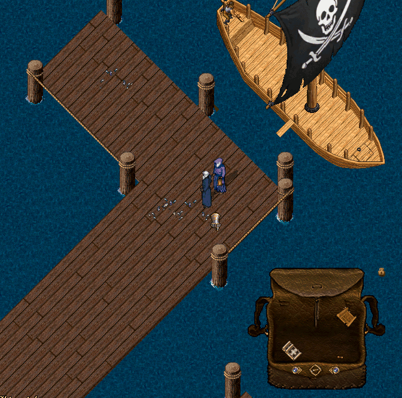

# Deniz Ticareti Sistemi

Nimloth’un liman şehirleri, denizlerin ticaret rotalarını belirleyen stratejik merkezlerdir.

Oyuncular, gemileriyle bu şehirler arasında mallar taşıyarak kazanç elde edebilir, ticaret becerilerini geliştirebilir ve ekonomik dengeye yön verebilirler.

## Ticaret Noktaları

Deniz ticareti toplamda <mark style="color:red;">**7 farklı**</mark> liman şehrinde başlatılabilir veya tamamlanabilir.

Her şehir, coğrafi konumu ve yerel üretim alışkanlıklarına göre belirli bir ticaret uzmanlık alanına sahiptir.

Bu nedenle yalnızca o şehrin kabul ettiği mal türlerini ticaret kargosuna ekleyebilirsiniz.

| Şehir          | Ticaret Türü             | Ticaret Edilebilen Eşyalar                                                           |
| -------------- | ------------------------ | ------------------------------------------------------------------------------------ |
| **Vesper**     | Blacksmith (Metal)       | _Ringmail_ ve _Chainmail_ set parçaları                                              |
| **Skara Brae** | Farming (Tarım)          | Tarımsal ürünler, tohumlar, bitkisel mallar                                          |
| **Ocllo**      | Fishing (Balıkçılık)     | Çeşitli balık türleri ve deniz mahsulleri                                            |
| **Moonglow**   | Scroll (Büyü Kağıtları)  | Büyü parşömenleri                                                                    |
| **Magincia**   | Cloth (Kumaş & Tekstil)  | Kumaş ile üretilmiş tekstil ürünleri                                                 |
| **Jhelom**     | Leather (Deri)           | İşlenmiş deri ürünleri                                                               |
| **Britain**    | Food & Drink (Yiyecek)   | Yemek ve içecek ürünleri _(<mark style="color:red;">**şu anda aktif değil**</mark>)_ |
| **Trinsic**    | Potion (İksir & Alchemy) | Alchemy ürünleri ve iksirler                                                         |

## Ticarete Başlama

Deniz ticaretine başlamak için şehir limanlarında yer alan Sea Trader vendorlarına giderek ticaret kaptanıyla görüşebilirsiniz.

Vendor’a çift tıkladığınızda sizi kaptan karşılayacak ve ticaret sürecini yönetebileceğiniz bir dialog arayüzü açılacaktır.

Bu arayüzde üç sekme yer almaktadır:

• Ticaret Yap

• Ticaretlerim

• Fiyatlar

İlk olarak Ticaret Yap sekmesinden başlayalım.

## Ticaret Yap

Bu sekme, yeni bir ticaret yolculuğuna çıkmadan önce işlemlerinizi başlatabileceğiniz ve sistemin nasıl çalıştığını öğrenebileceğiniz bölümdür.

Diyalogun sağ kısmında, bulunduğunuz şehrin ticaret türü hakkında bilgilendirici bir yazı göreceksiniz.

Bu yazıda, o şehirde hangi eşyaların ticaretinin yapılabileceği açıkça belirtilmektedir.

Örneğin: “Vesper şehrinde metal işçiliği ürünlerinin ticareti yapılabilir. Ringmail ve Chainmail set parçaları bu bölgede talep görmektedir.”

## Kontrat Alma

<mark style="color:red;">**‘Kontrat Al’**</mark> butonuna tıkladığınızda size iki eşya verilir:

Trade Contract (Ticaret Kontratı)

Trade Crate (Ticaret Sandığı)

Bu iki eşya, deniz ticaretinin temel taşlarıdır.

## Trade Crate

Trade Crate’e gemi içerisindeyken çift tıklayarak geminize yerleştirebilirsiniz.

<mark style="color:red;">**Trade Crate sadece sahibi olduğunuz gemilerde kullanılabilir ve her gemiye en fazla 1 adet Trade Crate konulabilir**</mark>

Gemide yer alan Crate'e çift tıklayarak açılan dialogdaki <mark style="color:red;">**"+"**</mark> butonu ile ticaretini yapmak istediğiniz eşyaları bu sandığa ekleyebilirsiniz.

Ekleyebileceğiniz eşyalar, bulunduğunuz şehrin ticaret türüne uygun olmalıdır.

Kurmuş olduğunuz Trade Crate hareket ettirilemez. Geminizden kaldırmak için Ticaret Kontratını tamamen iptal etmeniz gerekmektedir

Trade Crate'e eşya eklediğinizde Crate'e çift tıklayarak açılan dialogda doluluk oranının, tek tıkladığızda ise kontrat değerini görüntüleyebilirsiniz.

<figure><figcaption></figcaption></figure>

<figure><figcaption></figcaption></figure>

<figure><figcaption></figcaption></figure>

## Trade Contract

Trade Contract çantanızda yer alır ve ticaret sürecinizi yönetmenizi sağlar.

Trade Contract'a tek tıklayarak Kontrat değerini görüntüleyebilirsiniz.

<figure><figcaption></figcaption></figure>

Çift tıkladığınızda ise kontrat değerinizi görüntüleyebilir, kontratı imzalatabilir veya konratı sonlandırabilirsiniz.

<figure><figcaption></figcaption></figure>

## Kontratı İmzalama Süreci

İmzalat butonuna bastığınızda bir hedef belirlemeniz istenecektir.

Bu hedef ile Sea Trader vendoru seçmelisiniz. Sadece görevi aldığınız şehirdeki vendor bu kontratı imzalayabilmektedir.

İmza adımında gemide olmanız gereklidir, aksi taktirde Sea Trader kontratınızı imzalamayacaktır

Sea Trader vendorunu seçtiğinizde bir onay ekranı açılacak, onayladığınızda ise ticaretiniz resmiyet kazanacaktır.

Bu noktadan itibaren Ticaret Konratınızın rengi yeşil olacaktır ve artık ticaretiniz başlamış olur.

Kontrat imzalandıktan sonra ticareti **4 saat içinde teslim etmeniz gerekmektedir.**

<mark style="color:red;">**Bu süre içerisinde teslim edilmeyen ticaretler iptal edilir ve geçersiz sayılır.**</mark>

Not: Ticaret başladıktan sonra gemiden inebilir, runebook gibi eşyalar kullanabilirsiniz.

<figure><figcaption></figcaption></figure>

Ticarete başladığınızda tüm sunucuya ticaretin hangi şehirden başladığı ile ilgili bir bildirim mesajı paylaşılacaktır

<figure><figcaption></figcaption></figure>

<figure><figcaption></figcaption></figure>

## Ticaret İptal Etme

Ticareti, ister imzalamadan önce ister imzaladıktan sonra iptal edebilirsiniz.

Ancak iptal durumunda belirli bir kesinti uygulanır:

• Kontrat imzalanmadıysa, kontrat değerinden <mark style="color:red;">**%25**</mark>

• Kontrat imzaladıysa, kontrat değerinden <mark style="color:red;">**%50**</mark>

İptal et tuşuna bastığınızda karşınıza gelen dialogdan iptal durumunda ne kadar altın alacağınızı buradan görüntüleyebilirsiniz.

Bu kesinti, ticaret sisteminin istikrarını ve güvenilirliğini korumak amacıyla uygulanmaktadır.

Not: Geminiz batırıldığında veya gemide öldüğünüzde ticaretiniz iptal edilir.

<figure><figcaption></figcaption></figure>

## Ticaretin Teslim Edilmesi

Ticaretinizi tamamlamak istediğiniz noktayı dilediğiniz gibi seçebilirsiniz. Tek istisna, ticareti başlattığınız şehre teslimat yapamamanızdır.

Ticareti teslim etmek için çantanızdaki Trade Contract’a çift tıklayın ve ardından **“Teslim Et”** butonuna basın.

Bu işlemden sonra bir hedef belirlemeniz istenecektir. Hedef olarak bir Sea Trader Vendor seçtiğinizde, ticaretiniz başarıyla tamamlanacaktır.

Ticareti sadece gemideyken teslim edebilirsiniz

Teslimat başarıyla gerçekleştiğinde tüm sunucuya duyurulan bir bildirim mesajı paylaşılır ve emeğinizin karşılığı size banka çeki olarak verilir. Böylece kazancınızı doğrudan bankanıza yatırabilirsiniz.

**Ticareti teslim ettiğinizde o şehrin ticaretini yaptığınız eşyaya ihtiyaç miktarı azalacaktır, bu da şehre sonradan yapılan ticaretlerdeki kazanç miktarını etkilemektedir.**

## Fiyatlar Sekmesi

Deniz ticaretinde kazancınızı maksimize etmenin yolu, şehirlerin ihtiyaçlarını doğru takip etmekten geçer. Bu sekmede iki temel işlem yapabilirsiniz:

## 1. Şehir İhtiyaçlarını Görüntüleme

Bu bölümde tüm şehirlerin ticaret ihtiyaçlarını ve stok durumlarını görebilirsiniz.

Her gün şehirlerin stok miktarları rastgele bir saatte otomatik olarak yenilenir ve siz ticaret yaptıkça bu stoklar azalır.

Stok miktarı azaldıkça, şehrin o ürüne biçtiği ödül bedeli de düşer. Bu nedenle doğru zamanda doğru şehre ticaret yapmak oldukça önemlidir.

Farklı şehirlerin stok durumlarını görmek için İleri ve Geri butonlarını kullanabilirsiniz.

Ayrıca Filtre butonuna tıklayarak sadece belirlediğiniz başlangıç ve teslimat şehirlerinin stoklarını görüntüleyebilirsiniz.

En altta yer alan Tümünü Seç butonu ile tek tek seçmeden tüm şehirleri görüntüleyebilirsiniz

Filtrelerinizi belirledikten sonra “Filtreyi Uygula” butonuna basarak sonuçları görüntüleyebilirsiniz.

## Getiri Hesaplama

Deniz ticaretinde her rota aynı kazancı sağlamaz. Bu nedenle ticaretinizi başlatmadan önce olası kazancınızı hesaplamak akıllıca olacaktır.

Bu bölümde, yapmayı planladığınız ticaretin anlık tahmini getirisini görebilirsiniz.

Öncelikle Başlangıç Noktasının yanında yer alan **“Seç”** butonuna tıklayarak bir başlangıç ve teslimat noktası belirlemeniz gerekir.

Ardından, ticarete ekleyeceğiniz kontrat değerini girip **“Hesapla”** butonuna bastığınızda, sistem mesafe ve o anda geçerli stok durumuna göre size beklenen kazanç miktarını gösterecektir.

Unutmayın: Bu kazanç anlıktır ve teslimat yaptığınız andaki şehir stoklarına bağlı olarak değişiklik gösterebilir.

## Ticaretlerim

Yaptığınız tüm ticaretlerin kaydını burada bulabilirsiniz.

Bu sekme, geçmişte gerçekleştirdiğiniz ticaretleri takip etmenizi ve her birinin detaylarını incelemenizi sağlar.

Ana ekranda solda yer alan ticaret detayları butonuna tıkladığınızda, seçtiğiniz ticarete ait detaylı bilgilere ulaşabilirsiniz.

Detay ekranında şunlar yer alır:

• Rota bilgisi

• Ticaretin durumu

• Kontrat değeri

• Başlangıç ve bitiş tarihleri

• Geçen süre

• Mesafe ve ağırlık bilgileri

• Elde edilen kazanç

Ayrıca sol üstte bulunan liste butonuna tıklayarak tüm ticaretlerinizi toplu bir şekilde, liste görünümünde görüntüleyebilirsiniz.

Ticaret sistemi Nimloth ekonomisinin kalbidir. Akıllıca rotalar seçin, kârınızı artırın ve şehirlerin kaderini siz belirleyin!
