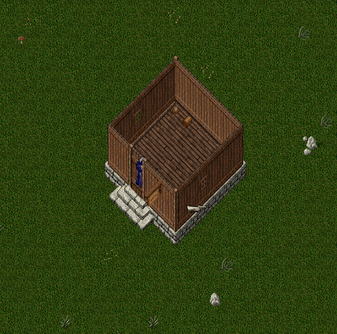
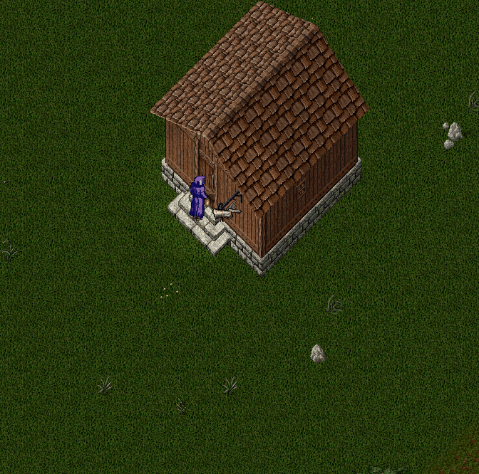

# Ev Sistemi

Nimloth dünyasında kendi evine sahip olmak, yalnızca bir ayrıcalık değil, aynı zamanda oyuncunun dünyadaki varlığının simgesidir.

Her oyuncu <mark style="color:red;">**hesap başına yalnızca bir ev**</mark> kurabilir. Bu nedenle kurulacak evi seçerken dikkatli olmak büyük önem taşır.

### Ev Kurulum Kuralları

Ev kurarken dikkat etmeniz gereken bazı temel kurallar vardır. Bu kurallar, hem dünyanın düzenini korumak hem de hatasız bir yerleşim yapmanızı sağlamak için gereklidir. Aşağıda, ev kurulumunda uymanız gereken koşullar şu şekildedir:

• Evler; tarla, ağaç, duvar, kaya, yol veya su gibi alanlara en az <mark style="color:red;">**2 kare mesafe**</mark> olacak şekilde yerleştirilmelidir.

• Oyunculara ait iki ev arasındaki mesafe en az <mark style="color:red;">**3 kare**</mark> olmalıdır. Bu kural, şehir düzenini ve alan dengesini korumak için zorunludur.

Ev yerleştirme sırasında tüm kontroller <mark style="color:red;">**otomatik olarak sistem tarafından yapılır**</mark>.

Eğer ev kurulum uygun değilse, hatalı noktalar deedler aracılığıyla görsel olarak işaretlenir ve açılan bir pencerede <mark style="color:red;">**evin kaç noktadan hata alındığı**</mark> oyuncuya bildirilir.

### Örnek 1

İlk ev kurulum örneğinde ev, başka bir oyuncuya ait ev ile olan uzaklık kontrolünü(3 kare) sağlarken tarla ile olan 2 karelik uzaklık kontrolünü sağlayamamaktadır. Bu sebeple tarla üzerine gelen 23 nokta işaretlenmiş ve oyuncuya gösterilmektedir

### Örnek 2

Bu kurulum örneğinde ev, başka bir oyuncuya ait ev ile olan uzaklık kontrolünü(3 kare) sağlayamamakta, ayrıca tarla ile olan 2 karelik uzaklık kontrolünü sağlayamamaktadır. Bu sebeple ev kontrolü sebebi ile 8 noktadan, tarla kontrolü sebebi ile ise 11 noktadan ev kurulum hatası almaktadır

<mark style="color:red;">**Evler sistem tarafından onaylanmış olsa dahi, yetkililer hatalı veya uygunsuz konumlandırılmış evleri tespit edip kaldırma hakkına sahiptir. Bu nedenle ev kurulumunda dikkatli olunması önerilir.**</mark>

### Başarılı Kurulum

Ev başarıyla kurulduğunda, oyuncuya evle ilgili kullanılabilecek komutları içeren bir bilgilendirme penceresi gösterilir. Bu pencere, ev sahipliği sürecine dair temel rehber niteliğindedir.

Bu komutlara ev içerisinde <mark style="color:red;">**"komutlar"**</mark> yazarak da ulaşabilirsiniz

## Ev Bilgi Arayüzü (Ev Tabelası)

Ev başarıyla kurulduktan sonra, ev tabelasına tek tıklayarak evinizin genel durumunu görüntüleyebilirsiniz.

Tabelaya tek tıkladığınızda evin genel durumunu görebilirsiniz

Tabelaya çift tıkladığınızda, eğer o eve sahip, ortak veya dost iseniz, karşınıza bir ev yönetim dialogu çıkacaktır.

Bu ekranda:

• Sol üstte, evin yıkılmasına kalan süre ve <mark style="color:red;">**"Evi Kaldır"**</mark> veya <mark style="color:red;">**"Evden Ayrıl"**</mark> butonu

• Ortada, evin görseli ve ismi,

• Sağda ise evi yenilemek için gereken ücret ve <mark style="color:red;">**Evi Yenile**</mark> butonu görüntülenmektedir.

Sol üstte yer alan buton, sahiplik durumunuza göre değişiklik gösterir:

• Eğer evin sahibi iseniz ve evin yenilenmesine 13 günden fazla süre varsa, <mark style="color:red;">**“Evi Kaldır”**</mark> butonunu göreceksiniz.

• Eğer eve dost veya ortak olarak eklenmişseniz, <mark style="color:red;">**“Evden Ayrıl”**</mark> butonu görünecektir.

Bu ekranın orta kısmında:

• Ev Sahibi bilgisi

• Evin adı

• Kurulma tarihi bilgileri yer alır

Ekranın alt kısmında ise ev türüne istinaden genel bilgiler yer almaktadır. Bu bilgiler ise şu şekildedir;

• Dost Sayısı

• Ortak Sayısı

• Sabit Eşya Adeti

• Strongbox Adeti

• Tezgahtar(Vendor) Sayısı

• Kuluçka Sayısı

• Secure Eşya Sayısı

Bu değerler evin büyüklüğüne göre değişiklik gösterir.

Evlere ait detaylı bilgilere oyun içerisindeki <mark style="color:red;">**House Crafting Tool**</mark> üzerinden veya wiki’deki evler sayfasından ulaşabilirsiniz.

### Evin Adını Değiştirme

Eğer evin sahibi sizseniz, evin isminin yanında bir isim düzenleme butonu bulunur.

Bu butona tıkladığınızda karşınıza yeni bir ekran çıkacaktır. Bu ekranda evin yeni ismini yazıp **Onayla** butonuna basarak evin ismini değiştirebilirsiniz

### Ev Yenileme

Evi yenileme ücreti günlük olarak artar ve evin boyutuna göre değişiklik gösterir. Eğer ev 14 gün içerisinde yenilenmezse, otomatik olarak yıkılır.

<mark style="color:red;">**Ancak önemli bir istisna vardır:**</mark>

Eğer [<mark style="color:red;">**premium**</mark>](https://nimloth-uo.gitbook.io/wiki/sistemler/premium-sistemi) <mark style="color:red;">**üyeyseniz**</mark> ve hesabınızda evi yenilemek için yeterli miktarda altın bulunuyorsa, eviniz otomatik olarak yenilenir.

Bu sayede premium oyuncular, çevrimdışı olsalar dahi evlerinin yıkılma riskinden korunurlar.

Evin yenileme işlemini ev sahibi, evin dostları veya ortakları yapabilir.

Ancak yenileme işlemi sahibi dışında biri tarafından yapıldığında, ev sahibine, evi kimin, ne zaman ve ne kadarlık bir ücretle yenilediğine dair bir bilgilendirme mesajı gönderilir.

### Dost ve Ortak Yönetimi

Evinizle ilgili sosyal yönetimleri, <mark style="color:red;">**"Dost/Ortak"**</mark> sekmesi üzerinden gerçekleştirebilirsiniz.

Bu sekmede, evin dost ve ortaklarını görüntüleyebilirsiniz. Görüntüleme anında çevrimiçi olan oyuncuların isimleri Yeşil, çevrimdışı olan oyuncuların isimleri ise Kırmızı olarak gözükecektir

Bu sekme ev sahibi, ortak ve dostlar için farklı yetkiler bulunmaktadır.

Ev sahibi olarak eve Dost/Ortak ekleyebilir, evin Dost/Ortaklarını evden çıkartabilirsiniz

Evin ortağı olarak eve Dost ekleyebilir, evin Dostlarını evden çıkartabilirsiniz

Evin dostu olarak sadece Dost/Ortakları görüntüleyebilirsiniz

### Dost/Ortak Ekleme

Yetkinize göre Dostlar ve Ortaklar sekmelerinin yanında yer alan <mark style="color:red;">**“+”**</mark> butonlarını görebilirsiniz.

Yeni bir dost veya ortak eklemek istediğinizde <mark style="color:red;">**“+”**</mark> butonuna bastığınızda bir hedef işaretçisi belirecektir.

Eklenecek oyuncu seçildiğinde, karşı tarafın ekranında bir onay penceresi açılır.

Oyuncu bu pencereyi <mark style="color:red;">**onayladığında**</mark> evinize dost veya ortak olarak eklenir.

 

### Dost/Ortak Çıkartma

Eğer yetkiniz mevcutsa, oyuncuların adının yanında yer alan <mark style="color:red;">**“X”**</mark> butonuna tıklayarak, o oyuncunun evle olan bağını kesebilirsiniz.

İşlem tamamlanmadan önce bir onay ekranı karşınıza çıkacaktır. Onay sonrası seçilen oyuncu evin Dost/Ortak listesinden çıkartılacaktır

### Ayarlar Sekmesi

Evinizi yönetmenin en detaylı yolu, Ayarlar Sekmesidir.

Bu sekme yalnızca <mark style="color:red;">**ev sahibi**</mark> tarafından açılabilir ve evle ilgili tüm yönetimsel işlemler buradan yapılabilir.

### Kilitli Kasalar (Secure Chests)

Bu bölümde, evinizde <mark style="color:red;">**secure**</mark> hale getirdiğiniz kasaları görüntüleyebilir ve her bir kasaya kimin erişebileceğini kolayca belirleyebilirsiniz.

Her kasa için dört farklı erişim seçeneği bulunmaktadır:

• Sadece ev sahibi erişebilir

• Sadece evin dostları erişebilir

• Sadece evin ortakları erişebilir

• Evin dost ve ortakları erişebilir

Kasanın erişim yetkisini değiştirmek için, görüntülediğiniz listeden dilediğiniz seçeneği seçmeniz yeterlidir.

Evin sahibi olarak bu seçenekleri istediğiniz an değiştirebilir ve kasalarınızı güvenli biçimde yönetebilirsiniz.

Not:Secure hale getirilen kasalar <mark style="color:red;">**varsayılan olarak sadece ev sahibinin erişimine açık**</mark> olacak şekilde ayarlanır.

<figure><figcaption></figcaption></figure>

### Tabelalar Sekmesi

Bu sekmede, evinizin dış cephesinde yer alan tabelayı dilediğiniz gibi değiştirebilirsiniz.

Nimloth dünyasında şu anda <mark style="color:red;">**toplam 55 farklı tabela tasarımı**</mark> bulunmaktadır.

Beğendiğiniz herhangi bir tabelayı <mark style="color:red;">**25.000 altın**</mark> karşılığında seçebilir ve evinize anında uygulayabilirsiniz.

### Sign Post Sekmesi

Bu sekmede toplam <mark style="color:red;">**6 farklı sign post**</mark> seçeneği bulunmaktadır.

Beğendiğiniz modeli <mark style="color:red;">**25.000 altın**</mark> karşılığında seçebilir ve evinize anında uygulayabilirsiniz.

Yapacağınız değişiklik hemen aktif hale gelir ve tabelanızla uyumlu, benzersiz bir görünüm oluşturur.

İster sade bir ahşap direk, ister zarif metal bir tasarım seçin. Evinizin tarzını tamamen siz belirleyebilirsiniz!

<figure><figcaption></figcaption></figure>

### Boyalar Sekmesi

Boyalar Sekmesi sayesinde evinizi dilediğiniz renkle boyayabilir, tarzınızı tamamen yansıtabilirsiniz.

Toplamda <mark style="color:red;">**14 farklı renk seçeneği**</mark> bulunmaktadır.

İsterseniz bu renkleri hemen uygulayabilir, isterseniz de önce test ederek nasıl göründüğüne karar verebilirsiniz.

Bir rengi test etmek için <mark style="color:red;">**50.000 altın**</mark> ödemeniz yeterlidir.

Ayrıca [<mark style="color:red;">**House Dye**</mark>](https://nimloth-uo.gitbook.io/wiki/sistemler/rare-dye-sistemi#house-dye) eşyasına sahipseniz, bu menü üzerinden seçtiğiniz rengi doğrudan evinize uygulayabilirsiniz.

Renkleri deneyin, tarzınızı belirleyin ve Nimloth dünyasında evinizi fark edilir kılın

<figure><figcaption></figcaption></figure>

### Anahtarlar Sekmesi

Evinizin güvenliği tamamen sizin kontrolünüzde!

Anahtarlar Sekmesi üzerinden evinize ait anahtarları yönetebilir, dilediğiniz zaman yeni anahtarlar oluşturabilir veya mevcut olanları silebilirsiniz.

Yeni bir anahtar oluşturmak için <mark style="color:red;">**50.000 altın**</mark> ödemeniz yeterlidir.

Eğer güvenliği tamamen sıfırlamak ve tüm mevcut anahtarları devre dışı bırakmak istiyorsanız, <mark style="color:red;">**250.000 altın**</mark> karşılığında eve ait tüm anahtarları silebilirsiniz.

### Vendorlar Sekmesi

Evinizde yer alan tüm vendorları tek bir ekrandan yönetebilirsiniz!

**Vendorlar Sekmesi** üzerinden evinizde kurulu vendorları görüntüleyebilir, her bir vendorun durumu ve özellikleri hakkında detaylı bilgi edinebilirsiniz.

Bu sekme aracılığıyla vendorların yapmış olduğu son satışları da inceleyebilirsiniz.

Ancak unutmayın, **Son Satışlar** sekmesi yalnızca **Premium üyeler** tarafından görüntülenebilir.

Dilerseniz vendorlarınızı bu sekmeden Kontrat haline getirebilirsiniz.

### Evi Transfer Et Sekmesi

**Evi Transfer Et Sekmesi** üzerinden sahip olduğunuz evi başka bir oyuncuya devredebilirsiniz.

Transfer işlemi sırasında dilerseniz evin mevcut **dostlarını ve ortaklarını** da yeni sahibine aktarabilirsiniz.

Transferin gerçekleşebilmesi için:

• Evin sahibinin en az **50.000 altın** bulundurması,

• Evin devredileceği oyuncunun ise en az **25.000 altına** sahip olması gerekmektedir.

Ancak dikkat edilmesi gereken önemli noktalar vardır:

• Ev satışta iken başka bir oyuncuya transfer edilemez.

• Transfer işlemi yapılırken evde **strongbox** veya **vendor** bulunmamalıdır.

Bu koşullar sağlandığında evinizi güvenle devredebilir, Nimloth dünyasında yeni sahiplerine bırakabilirsiniz.

### Evi Satışa Çıkart

Bu sekme aracılığıyla sahip olduğunuz evi belirlediğiniz fiyattan satışa çıkarabilirsiniz.

Evi satışa çıkartmak için **50.000 altın** gereklidir.

Evin minimum satış fiyatı **100.000 altın** olmalıdır.

Satış tamamlandığında, belirlediğiniz satış fiyatı üzerinden **%10 kesinti** yapılır.

Fiyat alanına satmak istediğiniz tutarı girdikten sonra **“Hesapla”** butonuna tıklayarak kesinti sonrasında elde edeceğiniz net geliri görebilirsiniz.

Tüm bilgiler doğruysa **“Satışa Çıkart”** butonuna basarak işlemi tamamlayabilirsiniz.

Eviniz satışa çıkarıldığında tabelası yeşil renge dönecektir.

Ayrıca premium üyeler, evlerinde yanan bir “Satılık” tabelasına da sahip olurlar.

### Ev Satın Alma

Bir oyuncu satışta olan bir evi tabelasına çift tıklayarak görüntüleyebilir. Bu sayede evin fiyatı ve özellikleri hakkında bilgi sahibi olabilir.

Eğer satın almak isterse, tabelada yer alan **“Satın Al”** seçeneğini kullanarak işlemi gerçekleştirebilir.

Evi satın alabilmek için:

• Oyuncunun başka bir evi bulunmamalıdır.

• Oyuncu, satın alınmak istenen eve dost veya ortak olarak ekli olmamalıdır.

Satış işlemi tamamlandığında, evi satan oyuncuya satışın gerçekleştiğine dair bir bilgilendirme mesajı gönderilir.

Bu mesajda evin kime ve ne kadar ücret karşılığında satıldığı bilgileri yer alır.

### Ev Tabelası ve Kalan Günler

Evlerin tabelasına tıklandığında evin bakım durumu ve yıkılmasına kalan günlere ait gelen mesajlar şu şekildedir.

| Ev Durumu      | Yıkılmasına Kalan Gün |
| -------------- | --------------------- |
| Yepyeni        | 12 gün üzeri          |
| Yeni           | 10-12 gün             |
| Bakımsız       | 7-10 gün              |
| Eskimiş        | 4-7 gün               |
| Dökülüyor      | 1-4 gün               |
| Yıkılmak Üzere | 1 günden az           |
