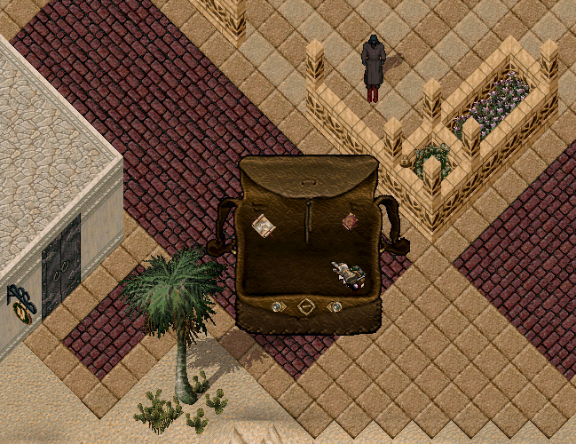

# Hazine Sistemi

Sosaria’nın denizlerinde ve yer altı madenlerinde, maceracıları bekleyen saklı hazineler var!

Hazine Sistemi sayesinde, denizlerden ağ ile yakaladığınız <mark style="color:red;">**Sos Bottle**</mark>’lar veya madenlerden çıkan <mark style="color:red;">**Treasure Container**</mark>'lar, çantanızda bir hazine haritasına dönüşebilir.

## Hazine Haritaları

Kırdığınız şişe veya sandıklar sayesinde değerli bir hazine haritası bulabilirsiniz, ancak düşük bir ihtimalle şişe veya sandıklar boş çıkabilir.

Bulduğunuz haritayı çözmek için [<mark style="color:red;">**Cartography**</mark>](https://nimloth-uo.gitbook.io/wiki/yetenekler/cartography) <mark style="color:red;">**yeteneğinizin 98.1**</mark> olması gerekir.

Haritayı çözdüğünüzde, tek tıkladığınızda hazineye ait bölge bilgisi, çift tıkladığınızda ise hazine konumu harita üzerinde çizim olarak gösterilir

<figure><figcaption></figcaption></figure>

<figure><figcaption></figcaption></figure>

Harita üzerinde bulunan <mark style="color:red;">**N butonuna**</mark> tıklayarak haritanın görüntüleme uzaklığını değiştirebilirsiniz. Toplamda <mark style="color:red;">**3 farklı uzaklık ayarı**</mark> bulunmaktadır. Bu ayarlar sayesinde haritayı daha detaylı inceleyebilir ve hazinenin bulunduğu konumu daha kolay tespit edebilirsiniz.

<figure><figcaption></figcaption></figure>

Haritadaki işaretleri takip ederek hazineye yaklaştığınızda, haritaya tekrar tıklayarak <mark style="color:red;">**yön okunu**</mark> görüntüleyebilir ve hazinenin gömülü olduğu konuma doğru ilerleyebilirsiniz.

Ayrıca World Map üzerinde hazine konumunu gösteren özel bir hazine ikonu da görüntülenir. Bu sayede hazineye ulaşmak için konumunuzu daha kolay takip edebilirsiniz.

<figure><figcaption></figcaption></figure>

## Hazineyi Kazmak

Hazine konumuna ulaştığınızda elinize <mark style="color:red;">**Pickaxe**</mark> alıp hazine haritasına tekrar tıklayarak kazmaya başlayabilirsiniz. Bir süre sonra kasa yüzeye çıkar. Ancak dikkatli olmalısınız:

Her hazine kasasında <mark style="color:red;">**orta veya zor seviyede bir tuzak bulunur**</mark>**.** Hazine kasasındaki tuzağı <mark style="color:red;">**90.0**</mark> [<mark style="color:red;">**Remove Trap**</mark>](https://nimloth-uo.gitbook.io/wiki/yetenekler/remove-trap) yeteneği ile etkisiz hale getirebilirsiniz.

Tuzak başarıyla etkisiz hâle getirilirse kasayı açarken <mark style="color:red;">**hiçbir koruyucu spawn olmaz**</mark>**.**

Tuzak patlarsa ciddi hasar alırsınız ve kasayı koruyan yaratıklar ortaya çıkar.

Kasayı açabilmek için <mark style="color:red;">**98.1**</mark> [<mark style="color:red;">**Lockpicking**</mark>](https://nimloth-uo.gitbook.io/wiki/yetenekler/lockpicking) yeteneğine sahip olmanız gerekir.

Ayrıca, hazine kazıldıktan sonra 30 dakika içerisinde açılmalıdır; aksi hâlde kasa yerin dibine çöker ve hazine kaybolur.

<mark style="color:red;">**Not: Hazine kasasını yüzeye çıkartmak için Mining yeteneğine ihtiyacınız yoktur.**</mark>

## Hazine Kasası İçeriği

Hazinenin içeriği, denizlerin ve yer altının derinliklerinden gelen gerçek bir serveti yansıtır:

• 6 - 10 adet Dragon Blood

• 6 - 10 adet Daemon Bone

• 25.000 - 30.000 altın

• [<mark style="color:red;">**Magical Mage Robe**</mark>](https://nimloth-uo.gitbook.io/wiki/esyalar/robelar/magical-robe)

• %50 şansla [<mark style="color:red;">**Invul Studded Armor**</mark>](https://nimloth-uo.gitbook.io/wiki/esyalar/zirhlar/magical-studded) parçası

• %33 şansla +9 ila +12 arası Magical Weapon

• %33 şansla [<mark style="color:red;">**Magic Cloth**</mark>](https://nimloth-uo.gitbook.io/wiki/esyalar/diger-esyalar/magic-cloth), [<mark style="color:red;">**Magic Crystal**</mark>](https://nimloth-uo.gitbook.io/wiki/esyalar/diger-esyalar/magic-crystal), [<mark style="color:red;">**Wizard Cloth**</mark>](https://nimloth-uo.gitbook.io/wiki/esyalar/diger-esyalar/wizard-cloth) veya [<mark style="color:red;">**Wizard Crystal**</mark>](https://nimloth-uo.gitbook.io/wiki/esyalar/diger-esyalar/wizard-crystal)

• %33 şansla [<mark style="color:red;">**Blueprint Combiner**</mark>](https://nimloth-uo.gitbook.io/wiki/esyalar/diger-esyalar/blueprint-combiner)

• %25 şansla [<mark style="color:red;">**Weapon Combiner**</mark>](https://nimloth-uo.gitbook.io/wiki/esyalar/diger-esyalar/weapon-combiner)

• %20 şansla Ostard Egg

• %16 şansla [<mark style="color:red;">**Cloth Dye, Furniture Dye, Ship Dye veya Hair Dye**</mark>](https://nimloth-uo.gitbook.io/wiki/sistemler/rare-dye-sistemi) [<mark style="color:red;">**Blueprint**</mark>](https://nimloth-uo.gitbook.io/wiki/sistemler/blueprint-sistemi)’leri

• %16 şansla [<mark style="color:red;">**Armor Bundler**</mark>](https://nimloth-uo.gitbook.io/wiki/esyalar/diger-esyalar/armor-bundler)

• %12 şansla [<mark style="color:red;">**Gem Stone**</mark>](https://nimloth-uo.gitbook.io/wiki/esyalar/gemstonelar)

• %10 şansla [<mark style="color:red;">**Runebook Linker**</mark>](https://nimloth-uo.gitbook.io/wiki/esyalar/diger-esyalar/runebook-linker)

Bazı eşyalar garanti ödülken, diğerleri tamamen şansınıza bağlıdır. Bu da her hazine avını heyecan dolu bir maceraya dönüştürür!
