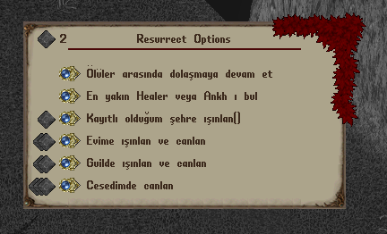

# Resurrect Options

Ölüm, Nimloth dünyasında sadece bir başlangıçtır. Yeni canlanma sistemi sayesinde artık ölüm anlarınızda daha fazla kontrol sizin elinizde.

Oyunda öldüğünüzde karakterinizin üzerinde bir Ankh simgesi belirir. Bu simgeye tıkladığınızda karşınıza bir canlanma seçenekleri menüsü çıkar. Bu menüde toplam 6 farklı seçenek sunulur:

<figure><figcaption></figcaption></figure>

## Ölüler Arasında Dolaşmaya Devam Et

Bu seçeneği tercih ettiğinizde, ruh formunuzla ölüler diyarında özgürce dolaşmaya devam edebilirsiniz.

## En Yakın Healer veya Ankh'ı Bul

Bu seçenekle bulunduğunuz konuma en yakın <mark style="color:red;">**Healer NPC**</mark> veya <mark style="color:red;">**Ankh**</mark> konumuna yönlendirilirsiniz. Ekranınızda bir yön oku belirir ve bu ok sizi ilgili noktaya götürür.

Eğer bir zindanda (dungeon) bulunuyorsanız yalnızca girişteki Ankh gösterilir. Yön okunu kapatmak için oka tek tıklamanız yeterlidir. Bu seçenek tamamen ücretsizdir.

## Kayıtlı Olduğum Şehre Işınlan

Bu seçeneği kullanarak daha önce kayıt yaptırdığınız şehre ışınlanabilir ve orada yeniden doğabilirsiniz.

Kullanım için:

• Şehirlerde yer alan <mark style="color:red;">**Şehir Kayıt Taşlarına**</mark> tıklayarak kayıt olmanız gerekir.

• Taşa tıkladığınızda karşınıza bir bilgilendirme ekranı çıkar. En altta mevcut kayıtlı olduğunuz şehir görüntülenir.

• Eğer o şehirde kayıtlı değilseniz, <mark style="color:red;">**“Şehre Kaydol”**</mark> butonunu kullanarak kayıt işlemini tamamlayabilirsiniz.

• Her oyuncu yalnızca bir şehre kayıt olabilir.

Bu seçeneği kullanabilmek için <mark style="color:red;">**1 adet**</mark> Resurrection Stone gereklidir.

## Evime Işınlan ve Canlan

Bu seçeneği tercih ettiğinizde 15 saniye içerisinde sahip olduğunuz eve ışınlanır ve orada hayata geri dönersiniz.

Gereklilikler:

• Bir eve sahip olmanız gerekir.

• Bu seçenek için <mark style="color:red;">**2 adet**</mark> Resurrection Stone gereklidir.

## Guilde Işınlan ve Canlan

Bu seçeneği tercih ettiğinizde 15 saniye içerisinde sahip olduğunuz eve ışınlanır ve orada hayata geri dönersiniz.

Gereklilikler:

• Bir guilde üye olmanız gerekir.

• Bu seçenek için <mark style="color:red;">**2 adet**</mark> Resurrection Stone gereklidir.

## Cesedimde Canlan

En riskli ama en doğrudan seçenektir. Bu tercihle birlikte 30 saniye sonra doğrudan cesedinizin bulunduğu yerde yeniden hayata dönebilirsiniz.

• Bu işlem için <mark style="color:red;">**3 adet**</mark> Resurrection Stone gereklidir.

• Canlanma işlemini başlatabilmek için 3 kare etrafınızda size ait bir cesedin bulunması gerekir. Eğer bu koşul sağlanmazsa seçenek kullanılamaz.

• Eğer 30 saniye içerisinde cesediniz yoksa (örneğin silinmişse parçalanmışsa), canlanma işlemi başarısız olur ve harcanan Resurrection Stone'lar iade edilmez.

Ana dialog ekranında ayrıca sahip olduğunuz Resurrection Stone miktarı da açıkça görüntülenmektedir. Bunun yanı sıra her bir seçeneğin kaç taş gerektirdiği bilgisi de ilgili seçeneğin yanında yer alır. Böylece hangi canlanma yönteminin sizin için uygun olduğunu hızlıca değerlendirebilirsiniz.

**Ev veya gemi içinde bu seçenekleri kullanmanız mümkün değildir.**

## Resurrection Stone Nedir ve Nasıl Kullanılır?

Resurrection Stone, undead yaratıklardan düşen ve Canlanma Seçenekleri sisteminde kullanılan özel bir eşyadır. Bu eşyayı kullanabilmek için önce çantanızdaki taşı "tüketmeniz" gerekir:

• Resurrection Stone üzerine çift tıklayın.

• Açılan dialog penceresinden <mark style="color:red;">**“Eşyayı Kullan”**</mark> seçeneğini tıklayın.

Bu işlem sonrasında Resurrection Stone sayınız sistemde tanımlanır ve Resurrect Options menüsünde görüntülenebilir hale gelir.

Dikkat: Bu kullanım işlemi geri alınamaz. Taşı kullandıktan sonra tekrar geri alamazsınız.

## Canlanma Penceresini Yeniden Açmak

Canlanma seçenekleri menüsünü (dialogu) kapattıysanız, tekrar açmak için <mark style="color:red;">**.res**</mark> komutunu kullanabilirsiniz. Böylece mevcut Resurrection Stone miktarınızı görebilir ve uygun bir canlanma seçeneği belirleyebilirsiniz.
