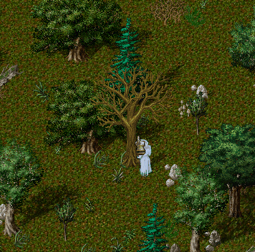

# Tree Grove Sistemi

Sosaria’nın ormanları artık daha da değerli! Yeni Tree Grove sistemi sayesinde Yew ve Trinsic bölgelerindeki ağaçlık alanlarda belirli aralıklarla ortaya çıkan özel ağaçları keserek nadir <mark style="color:red;">**Oak**</mark> ve <mark style="color:red;">**Yew**</mark> loglar elde edebilirsiniz.

## Tree Grove Nedir?

Sosaria üzerindeki ormanlık bölgelerde rastgele yerlerde beliren özel ağaçlara <mark style="color:red;">**Tree Grove**</mark> adı verilir. Bu ağaçlar, yalnızca odunculuk yeteneği 100 olan oyuncular tarafından kesilebilir. Ağacın türünü renk tonlarından anlayabilir veya doğrudan ağaca tıklayarak hangi tür olduğunu öğrenebilirsiniz.

## Kesim İçin Gerekenler

Kesim işlemi için mutlaka bir Hatchet'a ihtiyacınız vardır.

• Kullanılan Hatchet'ın türüne göre elde edilen log miktarı ve başarısız olma ihtimali değişiklik gösterir.

• Daha kaliteli Hatchet'lar, daha yüksek verim ve daha düşük başarısızlık oranı sağlar.

## Kesim Sırasında Dikkat Edilmesi Gerekenler

Kesim işlemi sırasında dikkat etmeniz gereken bazı önemli noktalar şunlardır:

• Kesim işlemi sırasında <mark style="color:red;">**hareket ederseniz**</mark>, işlem iptal olur.

• <mark style="color:red;">**Hasar alırsanız**</mark> , işlem iptal olur.

• <mark style="color:red;">**Başka bir eşyaya çift tıklarsanız**</mark>, işlem iptal olur.

• <mark style="color:red;">**Büyü kullanırsanız**</mark>, işlem iptal olur.

• <mark style="color:red;">**Elinizdeki Hatchet’ı bırakırsanız**</mark>, işlem iptal olur.

Not: Aynı anda yalnızca bir oyuncu aynı Tree Grove üzerinde kesim yapabilir. Başka biri kesim yapıyorsa, o işlem bitene kadar müdahale edemezsiniz.

<figure><figcaption></figcaption></figure>

