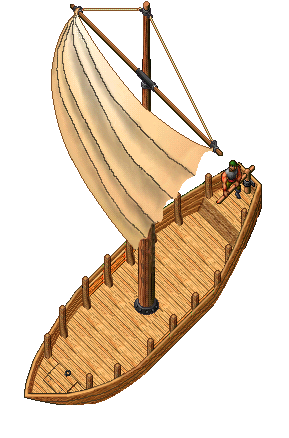

# Small Sloop

<figure><figcaption></figcaption></figure>

### **Yapımı İçin Gerekenler**

| Woodstone        | 5     |
| ---------------- | ----- |
| Nails            | 5     |
| Copper Wire      | 1     |
| Carpentry        | 100.0 |
| Tinkering        | 100.0 |
| Craft Mastery XP | 10    |

### Gemi Özellikleri

| Health                      | 100       |
| --------------------------- | --------- |
| Eşya Taşıma Kapasitesi      | 5000      |
| Kurulabilecek Cannon Sayısı | 1         |
| Bonus Tipi                  | Boost     |
| Bonus Süresi                | 3 Saniye  |
| Boya Durumu                 | Boyanamaz |
| Blueprint Gereksinimi       | Yok       |
