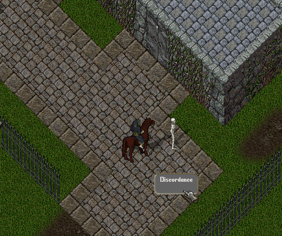

# Discordance

Discordance, oyuncuların yaratıkların stat ve skill değerlerini düşürmesini sağlayan güçlü bir destek yeteneğidir.&#x20;

Bu yetenek, özellikle grup savaşlarında veya güçlü yaratıklara karşı taktiksel avantaj sağlamak amacıyla kullanılır.

## Yetenek Mekaniği

Discordance, oyuncunun yetenek seviyesi ile orantılı olarak hedef yaratığın tüm <mark style="color:red;">**Strength**</mark><mark style="color:red;">,</mark> <mark style="color:red;"></mark><mark style="color:red;">**Dexterity**</mark><mark style="color:red;">,</mark> <mark style="color:red;"></mark><mark style="color:red;">**Intelligence**</mark> <mark style="color:red;"></mark><mark style="color:red;">ve</mark> <mark style="color:red;"></mark><mark style="color:red;">**Skill**</mark> <mark style="color:red;"></mark><mark style="color:red;">değerlerini azaltır.</mark>

Yetenek seviyesi arttıkça etkisi de güçlenir:

* 50 Skill → %10
* 80 Skill → %16
* 100 Skill → %21 - %25

## Kullanım Koşulları

* Çantanızda bir <mark style="color:red;">**Lute veya Yew Lute**</mark> bulunmalıdır.
* <mark style="color:red;">**Musicianship**</mark> yeteneği gerekmemektedir.
* Hedef ile en fazla <mark style="color:red;">**4 kare**</mark> mesafe içinde olunmalıdır.
* Bir yaratık aynı anda yalnızca bir Discordance etkisi altında bulunabilir.
* <mark style="color:red;">**2500 Strength**</mark> üzerindeki yaratıklarda bu yetenek kullanılamaz.
* Hedef yaratığın Strength değeri arttıkça başarılı olma şansı azalır.

## Hunter Mastery Etkileşimi

[<mark style="color:red;">**Hunter Mastery**</mark>](https://nimloth-uo.gitbook.io/wiki/sistemler/hunter-mastery-sistemi) <mark style="color:red;">**Seviye 14**</mark>'e ulaştığınızda ve Discordance yeteneğini <mark style="color:red;">**Yew Lute**</mark> kullanarak uyguladığınızda ek avantajlar elde edersiniz.

* Kullanım mesafesi <mark style="color:red;">**4 kareden 5 kareye**</mark> çıkar.
* Başarılı olma şansınız artar.
* Stat ve Skill azaltma oranı <mark style="color:red;">**%30'a kadar**</mark> yükselir.
* Hedef yaratığın <mark style="color:red;">**Armor**</mark> değeri tamamen sıfırlanır.

Armor değerinin sıfırlanması, yaratığın her aldığı fiziksel saldırıda daha fazla hasar almasını sağlar. Örneğin 90 Armor değerine sahip bir Crimson **Dragon** üzerinde Discordance kullanıldığında, normalde engelleyeceği yaklaşık <mark style="color:red;">**9 hasarı**</mark> artık engelleyemez. Bu da yaratığa yapılan her fiziksel saldırının yaklaşık <mark style="color:red;">**9 ek hasar**</mark> vermesi anlamına gelir.

## Yetenek Gelişimi

Discordance, yaratıklar üzerinde başarılı şekilde kullanıldığında gelişir.

Yetenek kazanım oranı <mark style="color:red;">(</mark><mark style="color:red;">**Skill Gain Rate**</mark><mark style="color:red;">)</mark> <mark style="color:red;"></mark><mark style="color:red;">**%100**</mark>'dür.

<figure><figcaption></figcaption></figure>

## Stratejik Kullanım

Discordance, özellikle güçlü boss yaratıklarında grubun toplam hasarını artıran en önemli destek yeteneklerinden biridir.

Yaratığın statlarının ve becerilerinin düşmesi hem aldığı hasarı artırır hem de oluşturduğu tehdidi azaltır. Hunter Mastery ile birlikte kullanılan Discordance ise Armor'u tamamen kaldırdığı için fiziksel hasar odaklı gruplarda çok daha büyük bir avantaj sağlar.

Discordance etkisi altındaki yaratıkları üzerlerinde bulunan **"**<mark style="color:red;">**Enticemented**</mark>**"** ibaresinden kolayca ayırt edebilirsiniz.
