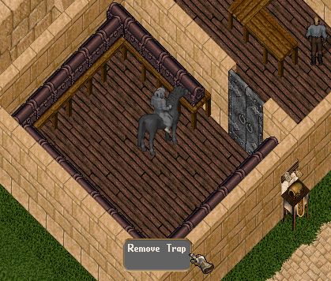
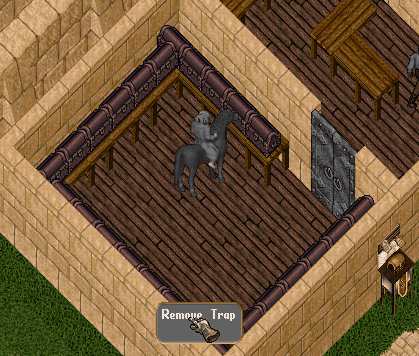
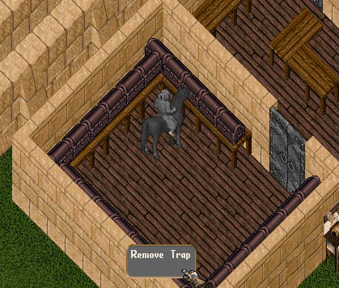
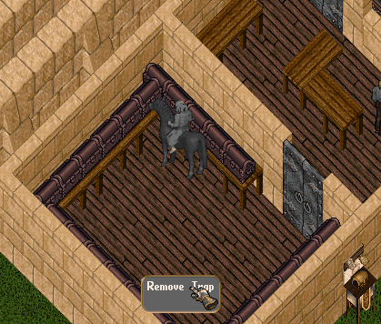
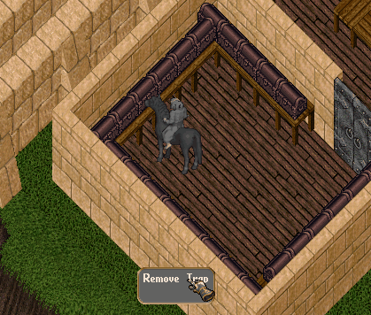
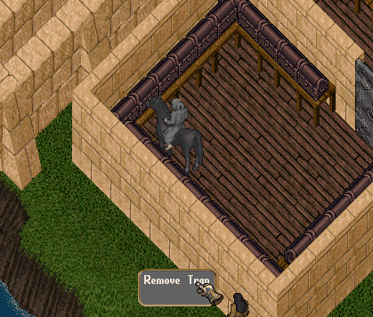
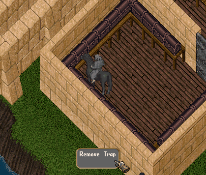
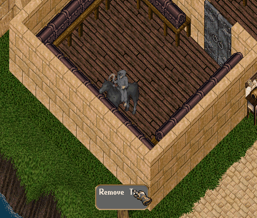
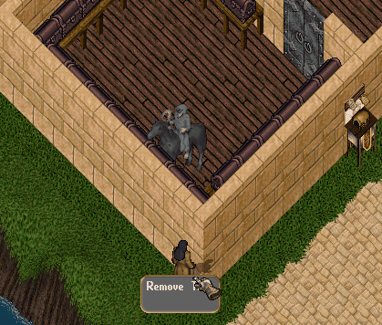

# Remove Trap

Remove Trap, <mark style="color:red;">**Dungeon Chest**</mark> ve <mark style="color:red;">**Treasure Chest**</mark> üzerinde bulunan tuzakları etkisiz hale getirmenizi sağlayan yardımcı yetenektir. Tuzağı başarıyla kaldırarak sandıkları güvenli şekilde açabilir ve ek tehlikelerle karşılaşmadan ödüllerinizi alabilirsiniz.

## Kullanım Alanları

Nimloth'taki <mark style="color:red;">**Dungeon Chest**</mark> ve <mark style="color:red;">**Treasure Chest**</mark>'ler farklı zorluk seviyelerinde tuzaklarla korunmaktadır.

Bir sandığa tıkladığınızda üzerinde tuzak bulunup bulunmadığını görebilir, ardından <mark style="color:red;">**Remove Trap**</mark> yeteneğini kullanarak tuzağı etkisiz hale getirmeyi deneyebilirsiniz.

## Tuzak Çözme Mekaniği

Remove Trap kullanıldığında bir mini oyun ekranı açılır.

Amacınız, <mark style="color:red;">**mavi başlangıç noktasından**</mark> <mark style="color:red;">**hareket ederek**</mark> <mark style="color:red;">**kırmızı hedef noktasına**</mark> doğru yolu bulmaktır.

* Mavi nokta mevcut konumunuzu gösterir.
* Yeşil noktalar ilerleyebileceğiniz geçerli adımları gösterir.

Doğru yolu bularak hedefe ulaştığınızda tuzak başarıyla kaldırılır.

<figure><figcaption></figcaption></figure>

<figure><figcaption></figcaption></figure>

## Training Chest

Remove Trap yeteneğinizi geliştirmek için şehirlerdeki bankalarda bulunan <mark style="color:red;">**Training Chest**</mark>'leri kullanabilirsiniz.

Training Chest'ler her zaman <mark style="color:red;">**Kolay**</mark> zorluk seviyesinde tuzak içerir ve yeteneğinizi güvenli şekilde geliştirmeniz için tasarlanmıştır.

<figure><figcaption></figcaption></figure>

## Deneme Hakları

Her sandık için <mark style="color:red;">**3 deneme hakkınız**</mark> bulunmaktadır.

Üç deneme sonunda tuzak kaldırılamazsa, sandık üzerindeki tuzak devreye girer.

* <mark style="color:red;">**Training Chest**</mark> kullanıyorsanız yalnızca düşük miktarda hasar alırsınız.
* <mark style="color:red;">**Dungeon Chest**</mark> ve <mark style="color:red;">**Treasure Chest**</mark>'lerde ise tuzağın seviyesine bağlı olarak yüksek hasar alabilir ve sandığın etrafında yaratıklar ortaya çıkabilir.

[<mark style="color:red;">**Hunter Mastery**</mark>](https://nimloth-uo.gitbook.io/wiki/sistemler/hunter-mastery-sistemi#oduller) <mark style="color:red;">**Seviye 7**</mark>'ye ulaştığınızda ek bir avantaj kazanırsınız. Remove Trap başarısız olsa bile, <mark style="color:red;">**%33 ihtimalle tuzak tetiklenmez**</mark>. Bu sayede başarısız denemelerinizin bir kısmında hasar almadan ve yaratık ortaya çıkmadan sandığı tekrar deneme şansı elde edebilirsiniz.

## Süre ve Kullanım Kuralları

Tuzak çözme işlemi başladığında <mark style="color:red;">**60 saniye**</mark> içerisinde tamamlanmalıdır.

Süre dolarsa pencere kapanır, ancak deneme hakkınız harcanmaz.

Bir oyuncu tuzağı çözmeye çalışırken:

* Başka bir oyuncu aynı sandığın tuzağını çözemez.
* Sandık, <mark style="color:red;">**Lockpicking**</mark> ile açılamaz.

## Zorluk Seviyeleri

Tuzaklar üç farklı zorluk seviyesine sahiptir:

* Kolay
* Orta
* Zor

Kolay ve Orta seviyelerde çözmeniz gereken hamle sayısı gösterilir.

**Zor** seviyedeki tuzaklarda ise bu bilgi gizlenir ve doğru yolu tamamen kendi gözleminizle bulmanız gerekir.

<figure><figcaption></figcaption></figure>

<figure><figcaption></figcaption></figure>

<figure><figcaption></figcaption></figure>

## Tuzak Başarıyla Kaldırıldığında

Tuzak başarıyla kaldırıldıktan sonra sandığı <mark style="color:red;">**Lockpicking**</mark> yeteneğiyle güvenli şekilde açabilirsiniz.

Bu durumda:

* Tuzak etkinleşmez.
* Ek yaratık ortaya çıkmaz.
* Sandığın ödüllerini güvenli şekilde alabilirsiniz.

## Tuzağı Atlayarak Sandığı Açmak

Sandığın tuzağını kaldırmadan doğrudan <mark style="color:red;">**Lockpicking**</mark> kullanmayı denerseniz, tuzak tam gücüyle etkinleşir.

Bu durumda:

* Çok daha yüksek hasar alırsınız.
* Sandığın seviyesine bağlı olarak daha fazla yaratık ortaya çıkar.

Bu nedenle sandıkları açmadan önce Remove Trap kullanmanız tavsiye edilir.

## Kombinasyonlar ve Çözüm Yöntemleri

Remove Trap mini oyununda karşınıza çıkabilecek toplam **12 farklı kombinasyon** bulunmaktadır. Her bir kombinasyon, mavi noktadan kırmızı noktaya ulaşmak için farklı bir yol çözümüne sahiptir. Bazı kombinasyonlar 4, bazı kombinasyonlar 6, bazıları ise 8 hamle yapmanızı gerektirmektedir.

Hamle miktarlarına göre çözüm kombinasyonları şu şekildedir;

### **Kombinasyon 1**

<figure><figcaption></figcaption></figure>

### **Kombinasyon 2**

<figure><figcaption></figcaption></figure>

### **Kombinasyon 3**

<figure><figcaption></figcaption></figure>

### **Kombinasyon 4**

<figure><figcaption></figcaption></figure>

### **Kombinasyon 5**

<figure><figcaption></figcaption></figure>

### **Kombinasyon 6**

<figure><figcaption></figcaption></figure>

### **Kombinasyon 7**

<figure><figcaption></figcaption></figure>

### **Kombinasyon 8**

<figure><figcaption></figcaption></figure>

### **Kombinasyon 9**

<figure><figcaption></figcaption></figure>

### **Kombinasyon 10**

<figure><figcaption></figcaption></figure>

### **Kombinasyon 11**

<figure><figcaption></figcaption></figure>

### **Kombinasyon 12**

<figure><figcaption></figcaption></figure>

## Yetenek Gelişimi

Remove Trap, kolay zorlukta gelişen bir yardımcı yetenektir.

Şehirlerdeki <mark style="color:red;">**Training Chest**</mark>'leri kullanarak güvenli bir şekilde yeteneğinizi geliştirebilir, daha sonra <mark style="color:red;">**Dungeon Chest**</mark> ve <mark style="color:red;">**Treasure Chest**</mark>'lerde bulunan tuzakları etkisiz hale getirebilirsiniz.
