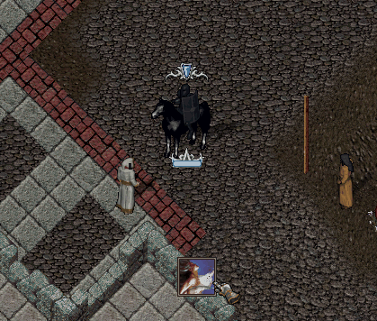

# Resisting Spells

Resisting Spells, büyülerden alacağınız hasarı azaltan savunma yeteneğidir. Özellikle büyü kullanan rakiplere karşı hem PvP hem de PvM'de önemli bir avantaj sağlar.

## Büyü Direnci

Resisting Spells seviyeniz arttıkça, üzerinize gelen büyülerden alacağınız hasar azalır.

Büyü hasarının azaltılması aşağıdaki formüle göre hesaplanmaktadır:

<mark style="color:red;">**Alınan Hasar = Gelen Hasar - %(Resisting Spells / 40)**</mark>

Bu sayede yetenek seviyeniz yükseldikçe büyülere karşı daha dayanıklı hale gelirsiniz.

## Büyülere Direnme

Resisting Spells yeteneğiniz <mark style="color:red;">**60.0**</mark> veya üzerindeyse, yetenek seviyenize bağlı olarak bazı büyülere tamamen direnme şansı kazanırsınız.

Bu bonus gerçekleştiğinde büyü sizi etkilemez ve karakterinizin üzerinde <mark style="color:green;">\* Etkilenmez \*</mark> ibaresi görüntülenir.

<figure><figcaption></figcaption></figure>

### Yetenek Gelişimi

Resisting Spells, kolay zorlukta gelişen bir savunma yeteneğidir. Büyülere maruz kaldıkça yetenek deneyimi kazanabilir ve Resisting Spells seviyenizi artırabilirsiniz.
